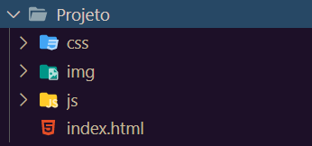

# A estrutura dos arquivos de um projeto

Como todo tipo de projeto de software, existem algumas recomendações quanto à organização
dos arquivos de um site. Não há nenhum rigor técnico quanto a essa organização e, na
maioria das vezes, você vai adaptar as recomendações da maneira que for melhor para o seu
projeto.

Como um site é um conjunto de páginas Web sobre um assunto, empresa, produto ou qualquer
outra coisa, é comum todos os arquivos de um site estarem dentro de uma só pasta e, assim
como um livro, é recomendado que exista uma "capa", uma página inicial que possa indicar
para o visitante quais são as outras páginas que fazem parte desse projeto e como ele pode
acessá-las, como se fosse o **índice** do site.

Ter esse índice, não por coincidência, é uma convenção adotada pelos servidores de páginas Web. Se
desejamos que uma determinada pasta seja servida como um site e dentro dessa pasta existe
um arquivo chamado **index.html**, esse arquivo será a página inicial, ou seja o índice, a menos que alguma
configuração determine outra página para esse fim.

Dentro da pasta do site, no mesmo nível que o `index.html`, é recomendado que sejam
criadas mais algumas pastas para manter separados os arquivos de imagens, as folhas de
estilo e os scripts. Para iniciar um projeto, teríamos uma estrutura de pastas como a
demonstrada na imagem a seguir:

Muitas vezes, um site é servido por meio de uma aplicação Web e, nesses casos, a estrutura
dos arquivos depende de como a aplicação necessita dos recursos para funcionar
corretamente. Porém, no geral, as aplicações também seguem um padrão bem parecido com o que
estamos adotando para o nosso projeto.

## Web site ou aplicação Web?

Quando estamos começando no mundo do desenvolvimento Web, acabamos por conhecer muitos termos novos, que por muitas vezes não são claros ou nos causam confusão. Vamos entender um pouco mais agora, qual a diferença de um Web site e uma aplicação Web.

### Web site
Podemos considerar um Web site uma coleção de páginas HTML estáticas, ou seja, que não interagem com um banco de dados através de uma linguagem de servidor Web. Ou seja, aqui todo o conteúdo do site está escrito diretamente no documento HTML, assim como as imagens e outras mídias. Claro que, para qualquer página Web ser fornecida publicamente a mesma deve estar hospedada em um simples servidor Web (hospedagem de sites).

### Aplicação Web
Uma aplicação Web pode conter uma coleção de páginas, porém o conteúdo destas páginas é montado dinamicamente, ou seja, é carregado através de solicitações (requisições) à um banco de dados, que conterá armazenado os textos e indicação dos caminhos das imagens ou mídias que a página precisa exibir. Porém um HTML não tem acesso direto à um banco de dados, e esta comunicação deve ser feita por uma linguagem de programação de servidor Web. Esta aplicação escrita com uma linguagem de servidor que tem o poder de acessar o banco de dados e montar a página HTML conforme o solicitado pelo navegador. Estas solicitações podem ser feitas de várias maneiras, inclusive utilizando JavaScript. Portanto uma aplicação Web é mais complexa porque precisa de uma linguagem de servidor para poder intermediar as solicitações do navegador, um banco de dados, e muitas vezes (porém não obrigatoriamente) exibir páginas HTML com estes conteúdos.

Exemplo de linguagens de servidor Web: Java EE, PHP, Python, Ruby on Rails, NodeJS etc...

## Editores e IDEs

Os editores de texto são programas de computador leves e ideais para escrever e editar as páginas de um site, como _Visual Studio Code_ (https://code.visualstudio.com/), _Sublime_
(https://www.sublimetext.com/), _Atom_ (https://atom.io/) e _Notepad++_
(https://notepad-plus-plus.org), que possuem realce de sintaxe e outras ferramentas
para facilitar o desenvolvimento de páginas. 

Há também **IDE**s (_Integrated Development
Environment_) que são editores mais robustos e trazem mais facilidades para o desenvolvimento de aplicações Web, se integrando com outras funcionalidades. São alguns deles: _WebStorm_ (https://www.jetbrains.com/webstorm/) _Eclipse_ (https://www.eclipse.org/) e _Visual Studio_ (https://visualstudio.microsoft.com).
