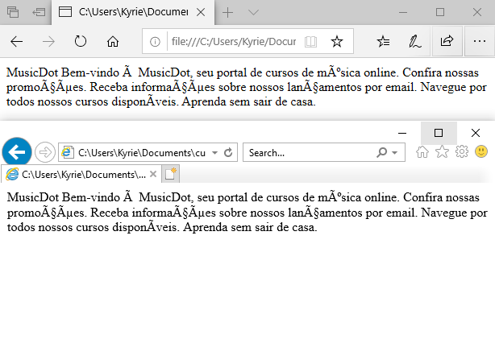
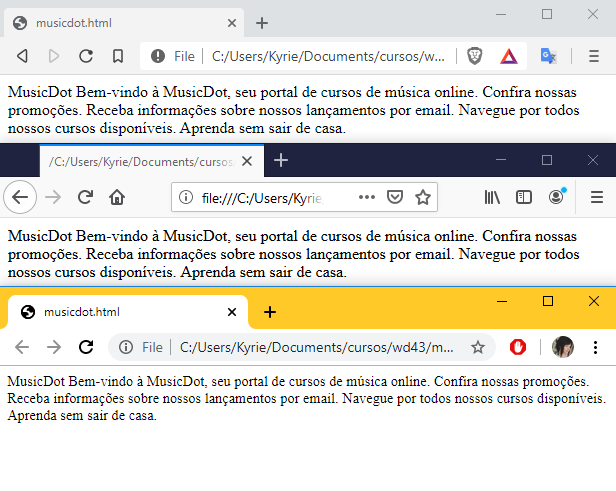

# Introdução ao HTML
_"Quanto mais nos elevamos, menores parecemos aos olhos daqueles que não
sabem voar." -- Friedrich Wilhelm Nietzsche_

## Exibindo informações na Web

A única linguagem que um navegador Web consegue interpretar para a exibição de conteúdo é o HTML. Para iniciar a exploração do HTML, vamos imaginar o seguinte caso: o navegador realizou uma requisição e recebeu como corpo da resposta o seguinte conteúdo:

  ``` html
  MusicDot

  Bem-vindo à MusicDot, seu portal de cursos de música online.

  Confira nossas promoções.
  Receba informações sobre nossos lançamentos por email.
  Navegue por todos nossos cursos disponíveis.
  Aprenda sem sair de casa.
  ```

Para conhecer o comportamento dos navegadores quanto ao conteúdo descrito antes, vamos reproduzir esse conteúdo em um arquivo de texto comum, que pode ser criado com qualquer editor de texto puro. Salve o arquivo como **index.html** e abra-o a partir do navegador à sua escolha.



Parece que obtemos um resultado um pouco diferente do esperado, não? Apesar de ser capaz de exibir texto puro em sua área principal, algumas regras devem ser seguidas caso desejemos
que esse texto seja exibido com alguma formatação, para facilitar a leitura pelo usuário final.

Uma nota de atenção é que a imagem acima foi tirada dos navegadores: **Microsoft Edge e Microsoft Internet Explorer 11**. Veja o que acontece quando obtemos a mesma imagem porém com navegadores mais atuais:



A imagem acima foi tirada nos navegadores: **Brave, Mozilla Firefox e Google Chrome**.

_Obs: existe a possibilidade de que mesmo nesses navegadores, se utilizada uma versão mais antiga, pode ser que o texto seja mostrado igual na foto dos navegadores da Microsoft_.

Usando os resultados acima podemos concluir que os navegadores mais antigos e até mesmo o **Microsoft Edge** por padrão:

* Podem não exibir caracteres acentuados corretamente;

Mas até mesmo nos navegadores mais novos:

* Não exibem quebras de linha.

Para que possamos exibir as informações desejadas com a formatação, é necessário que cada trecho de texto tenha uma **marcação** indicando qual é o significado dele. Essa marcação também influencia a maneira com que cada trecho do texto será exibido. A seguir é listado o texto com esta marcação esperada pelo navegador:

``` html
<!DOCTYPE html>
<html>
  <head>
    <title>MusicDot</title>
    <meta charset="utf-8">
  </head>
  <body>
    <h1>MusicDot</h1>
    <h2>Bem-vindo à MusicDot, seu portal de cursos de música online.</h2>
    <ul>
      <li>Confira nossas promoções.</li>
      <li>Receba informações sobre nossos lançamentos por email.</li>
      <li>Navegue por todos nossos cursos disponíveis.</li>
      <li>Aprenda sem sair de casa.</li>
    </ul>
  </body>
</html>
```

O texto com as devidas marcações, comumente chamado de "código". Reproduza então o código anterior em um novo arquivo de texto puro e salve-o como **index-2.html**. Não se preocupe com a sintaxe, vamos conhecer detalhadamente cada característica destas marcações nos próximos capítulos. Abra o arquivo no navegador.


Agora, uma página muito mais agradável e legível é exibida. Para isso, tivemos que adicionar as marcações que são pertencentes ao HTML. Essas marcações são chamadas de **tags**, e elas basicamente dão uma **representação** ao texto contido entre sua abertura e fechamento.

Apesar de estarem corretamente marcadas, as informações não apresentam pouco ou nenhum atrativo estético e, nessa deficiência do HTML, reside o primeiro e maior desafio de pessoas que desenvolvem para _front-end_.

O HTML (_Hypertext Markup Language_) ou linguagem de marcação de hipertexto foi desenvolvido para suprir a necessidade exibição de documentos científicos fornecidos por uma rede de Internet. Para termos uma comparação, é como se a Web fosse desenvolvida para exibir monografias redigidas e formatadas pela Metodologia do Trabalho Científico da ABNT. Porém, com o tempo e a evolução da Web e de seu potencial comercial, tornou-se necessária a exibição de informações com grande riqueza de elementos gráficos e de interação.

Começaremos por partes, primeiro entenderemos como o HTML funciona, para depois aprendermos estilos, elementos gráficos e interações.

## Sintaxe do HTML

O HTML é um conjunto de **tags** responsáveis pela marcação do conteúdo de uma página no navegador. No código que vimos antes, as tags são os elementos a mais que escrevemos usando a sintaxe `<nomedatag>`. Diversas tags são disponibilizadas pela linguagem HTML e cada uma possui uma funcionalidade específica.

No código de antes, vimos por exemplo o uso da tag `<h1>`. Ela representa o título principal da página.

  ``` html
  <h1>MusicDot</h1>
  ```

Note a sintaxe. Uma tag é definida com caracteres _`<`_ e _`>`_, e seu nome (**h1** no caso). Muitas tags possuem conteúdo, como o texto do título (_"MusicDot"_). Nesse caso, para determinar
onde o conteúdo acaba, usamos uma _tag de fechamento_ com a barra antes do nome: `</h1>`.

Algumas tags podem receber algum tipo de informação extra dentro de sua definição chamada de **atributo**. São parâmetros usando a sintaxe de `atributo="valor"`. Para definir uma imagem, por exemplo, usamos a tag `` e, para indicar o caminho que está essa imagem, usamos o atributo `src`:

  ``` html
  
  ```

Repare que a tag `img` não possui conteúdo por si só, e sim ela carrega ali o conteúdo de um arquivo externo (a imagem). Nesses casos, **não** é necessário usar uma tag de fechamento como antes no `h1`.

## Tags HTML

O HTML é composto de diversas tags, cada uma com sua função e significado. Desde 2013, com a atualização da linguagem para o HTML 5, muitas novas tags foram adicionadas, que veremos ao longo do curso.

Nesse momento, vamos focar em tags que representam **títulos**, **parágrafo** e **ênfase**.

### Títulos

Quando queremos indicar que um texto é um título em nossa página, utilizamos as tags de **_heading_** em sua marcação:

``` html
<h1>MusicDot</h1>
<h2>Bem-vindo à MusicDot, seu portal de cursos de música online.</h2>
```

As tags de _heading_ são para exibir conteúdo de texto e contém 6 níveis, ou seja de `<h1>` à `<h6>`, seguindo uma ordem de
importância, sendo `<h1>` o título principal, o mais importante, e `<h6>` o título de menor importância.

Utilizamos, por exemplo, a tag `<h1>` para o nome, título principal da página, e a tag `<h2>` como subtítulo ou como título de seções dentro do documento.

_Obs: a tag `<h1>` só pode ser utilizada uma vez em cada página porque não pode existir mais de um conteúdo mais importante da página._

A ordem de importância tem impacto nas ferramentas que processam HTML. As ferramentas de indexação de conteúdo para buscas, como o Google, Bing ou Yahoo! levam em consideração essa ordem e relevância. Os navegadores especiais para acessibilidade também interpretam o conteúdo dessas tags de maneira a diferenciar seu conteúdo e facilitar a navegação do usuário pelo documento.

### Parágrafos

Quando exibimos qualquer texto em nossa página, é recomendado que ele seja sempre conteúdo de alguma tag filha da tag `<body>`. A marcação mais indicada para textos comuns é a tag de **parágrafo**:

``` html
<p>
  A MusicDot é a maior escola online de música em todo o mundo.
</p>
```

Se você tiver vários parágrafos de texto, use várias dessas tags `<p>` para separá-los:

``` html
<p>
  A MusicDot é a maior escola online de música em todo o mundo.
</p>
<p>
  Nossa matriz fica em Mafra, em Santa Catarina. De lá, saem  grande parte das gravações de nossos cursos.
</p>
```

### Marcações de ênfase

Quando queremos dar uma ênfase diferente a um trecho de texto, podemos utilizar as marcações de ênfase. Podemos deixar um texto "mais forte" com a tag `<strong>` ou deixar o texto com uma "ênfase acentuada" com a tag `<em>`. Do mesmo jeito que a tag `<strong>` deixa a tag "mais forte", temos também a tag `<small>`, que diminui o "peso" do texto.

Por padrão, os navegadores exibem o texto dentro da tag `<strong>` em negrito e o texto dentro da tag `<em>` em itálico. Existem ainda as tags `<b>` e `<i>`, que atingem o mesmo resultado visualmente, mas as tags `<strong>` e `<em>` são mais indicadas por
definirem nossa intenção de significado ao conteúdo, mais do que uma simples indicação visual. Vamos discutir melhor a questão do significado das tags mais adiante.

``` html
<p>Aprenda de um jeito rápido e barato na <strong>MusicDot</strong>.</p>
```

## Imagens

A tag `` indica para o navegador que uma imagem deve ser "renderizada" (mostrada/desenhada) naquele lugar e necessita dois atributos preenchidos: `src` e `alt`. O primeiro é um atributo obrigatório para exibir a imagem e aponta para a sua localização (pode ser um local do seu computador ou um endereço na Web), já o segundo é um texto alternativo que aparece caso a imagem não
possa ser carregada ou visualizada. 

O atributo `alt` não é obrigatório, porém é considerado um erro caso seja omitido, pois ele provê o entendimento da imagem para pessoas com deficiência que necessitam o uso de leitores de tela para acessar o computador, e também auxilia na indexação da imagem para motores de busca, como o Google etc.

O HTML 5 introduziu duas novas tags específicas para imagem: `<figure>` e `<figcaption>`. A tag `<figure>` define uma imagem em conjunto com a tag ``. Além disso, permite adicionar uma legenda para a imagem por meio da tag `<figcaption>`.

``` html
<figure>
  
  <figcaption>Matriz da MusicDot</figcaption>
</figure>
```

## Primeira página

A primeira página que desenvolveremos para a _MusicDot_ será a _Sobre_, que explica detalhes sobre a empresa, apresenta fotos e a história.

Recebemos o design já pronto, assim como os textos. Nosso trabalho, como pessoas desenvolvedoras de front-end, é codificar o HTML e CSS necessários para esse resultado.


> **Boa prática - Indentação**
>
> Uma prática sempre recomendada, ligada à limpeza e utilizada para facilitar a leitura do código, é o uso correto de **recuos**, ou **indentação**, no HTML. Costumamos alinhar elementos "irmãos" na mesma margem e adicionar alguns espaços ou um _tab_ para elementos "filhos".
>
> A maioria dos exercícios dessa apostila utiliza um padrão recomendado de recuos.


> **Boa prática - Comentários**
>
> Quando iniciamos nosso projeto, utilizamos poucas tags HTML. Mais tarde adicionaremos uma quantidade razoável de elementos, o que pode gerar uma certa confusão. Para manter o código mais legível, é recomendada a adição de comentários antes da abertura e após do fechamento de tags estruturais (que conterão outras tags). Dessa maneira, nós podemos identificar claramente quando um elemento está **dentro** dessa estrutura ou **depois** dela.
>

``` html
  <!-- início do cabeçalho -->
  <header>
    <p>Esse parágrafo está <strong>dentro</strong> do cabeçalho.</p>
  </header>
  <!-- fim do cabeçalho -->

  <p>Esse parágrafo está <strong>depois</strong> do cabeçalho.</p>
```
