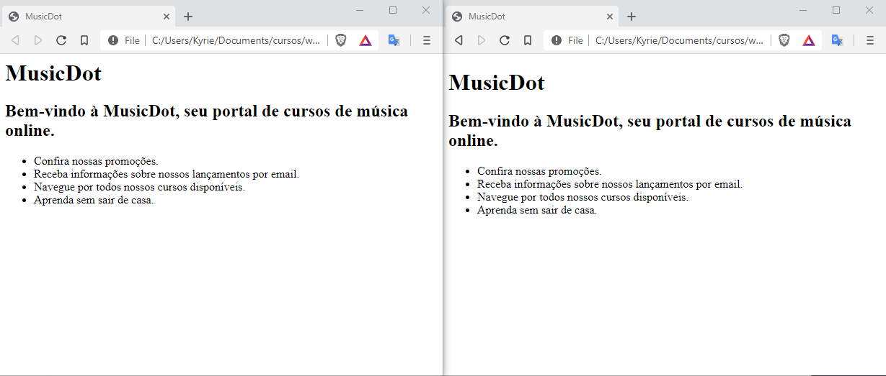

# Estrutura de um documento HTML

Um documento HTML válido precisa seguir obrigatoriamente a estrutura composta pelas tags
`<html>`, `<head>` e `<body>` e a instrução `<!DOCTYPE>`. Esta estrutura está informada em uma documentação que descreve todos os detalhes do HTML, no caso as tags e atributos, e como os navegadores devem considerar e interpretar estas tags, esta documentação é chamada de "especificação do HTML", e através do que está declarado nela que é possível entender se um documento HTML válido. Um documento HTML inválido é carregado pelo navegador, porém em um "_modo de compatibilidade_", vamos entender melhor sobre isto logo mais.

Abaixo, vamos conhecer em detalhes cada uma das tags estruturais obrigatórias:  

## A tag `<html>`
Na estrutura do nosso documento, antes de começar a colocar o conteúdo, inserimos uma tag `<html>`. Dentro dessa tag, é necessário declarar outras duas tags: `<head>` e `<body>`. Essas duas tags são "irmãs", pois estão no mesmo nível hierárquico em relação à sua tag "mãe", que é `<html>`.

  ``` html
  <html> <!-- mãe -->
    <head></head> <!-- filha -->
    <body></body> <!-- filha -->
  </html>
  ```

## A tag `<head>`
A tag `<head>` contém informações sobre o documento HTML que são de interesse somente do navegador e para outros serviços da web, e não para as pessoas que vão acessar nosso site. São informações que não serão exibidas diretamente no navegador, também podemos considerar um local onde informamos os metadados sobre a página.

A especificação do HTML obriga a presença da tag de conteúdo `<title>` dentro da `<head>`, permitindo definir o título do documento, que poder ser visto na _barra de título_ ou _aba_ da janela do navegador. Caso contrário, a página não será um documento HTML válido.

Outra configuração muito importante, principalmente em documentos HTML cujo conteúdo é escrito em um idioma como o português, que contém caracteres "especiais" (acentos e cedilha), é a codificação/conjunto de caracteres, chamada de **encoding** ou **charset**.

Podemos configurar qual codificação queremos utilizar em nosso documento por meio da configuração de `charset` na tag `<meta>`. Um dos valores mais comuns usados hoje em dia é o **UTF-8**, também chamado de **Unicode**. Há outras possibilidades, como o **latin1**, muito usado antigamente.

O **UTF-8** é a recomendação atual para encoding na Web por ser amplamente suportada em navegadores e editores de código, além de ser compatível com praticamente todos os idiomas do mundo. É o que usaremos no curso.

``` html
<html>
    <head>
      <meta charset="utf-8">
      <title>MusicDot</title>
    </head>
    <body>

    </body>
</html>
```

## A tag `<body>`
A tag `<body>` contém o corpo de um documento HTML, que é exibido pelo navegador em sua janela, ou seja, todo o conteúdo visível do site. É necessário que o `<body>` tenha ao menos um elemento "filho", ou seja, uma ou mais tags HTML dentro dele.

``` html
<html>
  <head>
    <meta charset="utf-8">
    <title>MusicDot</title>
  </head>
  <body>
    <h1>A MusicDot</h1>
  </body>
</html>
```

Nesse exemplo, usamos a tag `<h1>`, que indica o título principal da página.

## A instrução DOCTYPE

O `DOCTYPE` não é uma tag HTML, mas uma instrução especial. Ela indica para o navegador qual **versão do HTML** deve ser utilizada para exibir a página. Quando não colocamos essa instrução a página é exibida numa espécie de "_modo de compatibilidade_" na qual algumas tags e estilizações não funcionam 100% corretamente. Principalmente as tags e estilizações mais atuais (lançadas na versão 5 do HTML). Inclusive é possível ver a diferença na folha de estilos padrão que o navegador usa quando não colocamos essa instrução.



A imagem da esquerda é a página **sem** `Doctype` e a imagem da direita é a página **com** `Doctype`. Dá para ver que existe uma leve diferença entre as duas páginas, principalmente com relação aos espaçamentos.

Utilizaremos `<!DOCTYPE html>`, que indica para o navegador a utilização da versão mais recente do HTML - a versão 5, atualmente*.

Há muitas possibilidades mais complicadas nessa parte de `DOCTYPE` que eram usados em versões anteriores do HTML e do XHTML. Hoje em dia, nada disso é mais importante. O recomendado é **sempre usar a última versão do HTML**, usando a declaração de `DOCTYPE` simples:

  ``` html
  <!DOCTYPE html>
  ```

  A declaração do DOCTYPE, pode ser escrita toda em maiúsculo ou toda em minúsculo ou com a primeira letra maiúscula: `<!DOCTYPE HTML>`, `<!DOCTYPE html>`, `<!Doctype HTML>`, `<!Doctype html>`, `<!doctype html>`, `<!doctype HTML>`. O resultado será o mesmo para todos os casos.

*_Obs: desde maio de 2019 o desenvolvimento do HTML é mantido pelo W3C (World Wide Web Consortium) <https://www.w3.org/>, WHATWG e comunidade de desenvolvedores, e sua especificação é aberta no Github <https://github.com/whatwg/html>, e desde este movimento o HTML é considerado um "padrão vivo" (living standard) onde sua versão a partir da 5 é atualizada continuamente_.