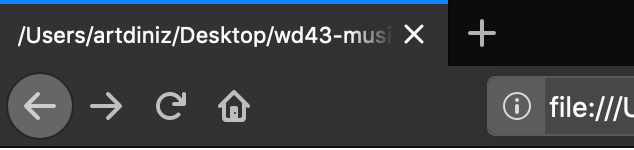
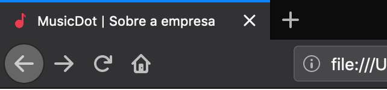

# Exercício: A Especificação HTML

## Objetivo
      
Nesse momento a aba do navegador está exibindo o caminho e o nome do arquivo "sobre.html"


Nesse exercício mudaremos algumas informações da nossa página. A diferença é que essas informações serão apenas para o navegador e não devem ser exibidas como conteúdo da página.

As informações que passaremos para o navegador são:
* O texto que aparecerá na aba do navegador: **"MusicDot | Sobre a empresa"**
* O ícone que aparecerá na aba do navegador: **"img/favicon.ico"**
* Qual o "charset" que será usado para o conteúdo da aba e da página: **"utf-8"**
* Qual o idioma principal da página: **"pt-BR"**
* Qual a versão do HTML está sendo usada: **"a mais atual suportada pelo navegador"**


Ao final do exercício deve ser possível escrever e ler caractéres acentuados no conteúdo da página.
Ao final, também, a aba do navegador deve apresentar o texto e o ícone:



## Passo a passo com código

1. No arquivo **`sobre.html`** na pasta **`raíz do projeto`** faça as seguintes alterações:

    ###### # sobre.html
    ```html
    -<̶i̶m̶g̶ s̶r̶c̶=̶"̶i̶m̶g̶/̶l̶o̶g̶o̶.̶s̶v̶g̶"̶ a̶l̶t̶=̶"̶M̶u̶s̶i̶c̶D̶o̶t̶"̶>̶
    +<!doctype html>
    +<html lang="pt-BR">
    +  <head>
    +    <meta charset="utf-8">
    +    <title>
    +      MusicDot | Sobre a empresa
    +    </title>
    +    <link href="img/favicon.ico" rel="icon">
    +  </head>
       
    -<̶h̶1̶>̶ S̶o̶b̶r̶e̶ a̶ e̶m̶p̶r̶e̶s̶a̶ <̶/̶h̶1̶>̶
    +  <body>
         
    -<̶p̶>̶
    +    
    +    
    +    <h1> Sobre a empresa </h1>
    +    
    +    <p>
           A MusicDot é a maior escola online de música em todo o mundo.
           Fundada em 1932, possui estúdios em 124 países, sendo líder de mercado com mais de 90% de
           participação em 118 deles.
    -<̶/̶p̶>̶
    +    </p>
         
    -<̶p̶>̶
    +    <p>
           Nossa matriz fica em Mafra, em Santa Catarina. De lá, saem grande parte das gravações de nossos cursos. Nossa matriz:
    -<̶/̶p̶>̶
    +    </p>
         
    -<̶f̶i̶g̶u̶r̶e̶>̶
    +    <figure>
           
           <figcaption> 
               Matriz MusicDot 
           </figcaption>
    -<̶/̶f̶i̶g̶u̶r̶e̶>̶
    +    </figure>
         
    -<̶p̶>̶
    +    <p>
           Assine os cursos da MusicDot. Acesse nosso site ou entre em contato
           se tiver dúvidas. Conheça também nossa história e nossos diferenciais.
    -<̶/̶p̶>̶
    +    </p>
         
    -<̶h̶2̶>̶ H̶i̶s̶t̶ó̶r̶i̶a̶ <̶/̶h̶2̶>̶
    +    <h2> História </h2>
         
    -<̶f̶i̶g̶u̶r̶e̶>̶
    +    <figure>
           
           <figcaption>Família Tüpfeln</figcaption>
    -<̶/̶f̶i̶g̶u̶r̶e̶>̶
    +    </figure>
         
    -<̶p̶>̶
    +    <p>
           A fundação em 1932 ocorreu no momento da descoberta econônica de cursos por stream online no interior de Santa Catarina. A
           família Tüpfeln, tradicional da região, investiu todas as suas economias nessa nova iniciativa,
           revolucionária para a época. A fundadora frau Dagmar Olaf Tüpfeln, dotada de particular visão
           administrativa, guiou os negócios da empresa durante mais de 50 anos, muitos deles ao lado
           de seu filho Ernst Noten Tüpfeln, atual CEO. O nome da empresa é inspirado no nome da família.
    -<̶/̶p̶>̶
    +    </p>
         
    -<̶p̶>̶
    +    <p>
           O crescimento da empresa foi praticamente instantâneo. Nos primeiros 5 anos, já atendia 18 países.
           Bateu a marca de 100 países em apenas 15 anos de existência. Até hoje, já atendeu 2 bilhões
           de usuários diferentes, em bilhões de diferentes pedidos.
    -<̶/̶p̶>̶
    +    </p>
         
    -<̶p̶>̶
    +    <p>
           O crescimento em número de funcionários é também assombroso. Hoje, é a maior empregadora do
           Brasil, mas mesmo após apenas 5 anos de sua existência, já possuía 30 mil funcionários. Fora do
           Brasil, há 240 mil funcionários, além dos 890 mil brasileiros nas instalações de Mafra e
           nos escritórios em todo país.
    -<̶/̶p̶>̶
    +    </p>
         
    -<̶p̶>̶
    +    <p>
           Dada a importância econômica da empresa para o Brasil, a família Tüpfeln já recebeu diversos prêmios,
           homenagens e condecorações. Todos os presidentes do Brasil já visitaram as instalações da MusicDot, além de presidentes da União Européia, Ásia e o secretário-geral da ONU.
    -<̶/̶p̶>̶
    +    </p>
    +  
    +  </body>
    +</html>
    ```
