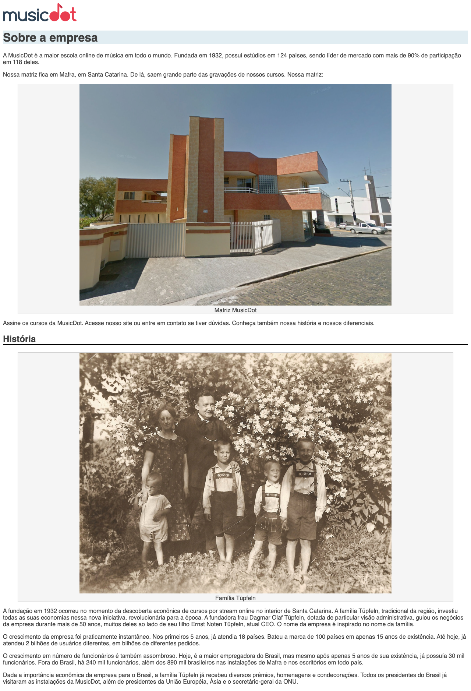

# Exercício: Mudando o visual da nossa página

## Objetivo
      
Começaremos a alterar o visual da nossa página para deixá-la mais agradável.

Primeiro precisamos criar nosso arquivo de estilo e importá-lo no nosso html. Dentro desse arquivo utilizaremos os **seletores CSS** para escolher as tags/elementos que queremos estilizar e depois aplicaremos as **propriedades do CSS**.

As mudanças de estilo serão:
* Na página toda: trocar a família da fonte de toda a página
* No título principal: alterar a cor da fonte para um cinza-escuro **"#3D3D3D"**
* No título principal: colocar uma cor de fundo cinza-azulado **"#E1EDF2"**
* Nos subtítulos: colocar uma borda na parte de baixo
* Nas figuras: centralizar o conteúdo
* Nas figuras: colocar uma cor de fundo chamada **"whitesmoke"**
* Nas figuras: alterar a cor da fonte para um cinza-claro **"lightgrey"**

A página ficará assim:



## Passo a passo com código

1. Crie o arquivo **`sobre.css`** na pasta **`css`** com o seguinte código:

    ###### # css/sobre.css
    ```css
    +body {
    +  font-family: "Helvetica", "Lucida Grande", sans-serif;
    +  color: #3D3D3D;
    +}
    +
    +h1 {
    +  background-color: #E1EDF2;
    +}
    +
    +h2 {
    +  border-bottom: 2px solid black;
    +}
    +
    +figure {
    +  text-align: center;
    +
    +  background-color: whitesmoke;
    +  border: 1px solid lightgrey;
    +}
    ```

2. No arquivo **`sobre.html`** na pasta **`raíz do projeto`** faça as seguintes alterações:

    ###### # sobre.html
    ```html
     <!doctype html>
     <html lang="pt-BR">
       <head>
         <meta charset="utf-8">
         <title>
           MusicDot | Sobre a empresa
         </title>
         <link href="img/favicon.ico" rel="icon">
    +    <link rel="stylesheet" href="css/sobre.css">
       </head>
       
       <body>
         
         
         
         <h1> Sobre a empresa </h1>
         
         <p>
           A MusicDot é a maior escola online de música em todo o mundo.
           Fundada em 1932, possui estúdios em 124 países, sendo líder de mercado com mais de 90% de
           participação em 118 deles.
         </p>
         
         <p>
           Nossa matriz fica em Mafra, em Santa Catarina. De lá, saem grande parte das gravações de nossos cursos. Nossa matriz:
         </p>
         
         <figure>
           
           <figcaption> 
               Matriz MusicDot 
           </figcaption>
         </figure>
         
         <p>
           Assine os cursos da MusicDot. Acesse nosso site ou entre em contato
           se tiver dúvidas. Conheça também nossa história e nossos diferenciais.
         </p>
         
         <h2> História </h2>
         
         <figure>
           
           <figcaption>Família Tüpfeln</figcaption>
         </figure>
         
         <p>
           A fundação em 1932 ocorreu no momento da descoberta econônica de cursos por stream online no interior de Santa Catarina. A
           família Tüpfeln, tradicional da região, investiu todas as suas economias nessa nova iniciativa,
           revolucionária para a época. A fundadora frau Dagmar Olaf Tüpfeln, dotada de particular visão
           administrativa, guiou os negócios da empresa durante mais de 50 anos, muitos deles ao lado
           de seu filho Ernst Noten Tüpfeln, atual CEO. O nome da empresa é inspirado no nome da família.
         </p>
         
         <p>
           O crescimento da empresa foi praticamente instantâneo. Nos primeiros 5 anos, já atendia 18 países.
           Bateu a marca de 100 países em apenas 15 anos de existência. Até hoje, já atendeu 2 bilhões
           de usuários diferentes, em bilhões de diferentes pedidos.
         </p>
         
         <p>
           O crescimento em número de funcionários é também assombroso. Hoje, é a maior empregadora do
           Brasil, mas mesmo após apenas 5 anos de sua existência, já possuía 30 mil funcionários. Fora do
           Brasil, há 240 mil funcionários, além dos 890 mil brasileiros nas instalações de Mafra e
           nos escritórios em todo país.
         </p>
         
         <p>
           Dada a importância econômica da empresa para o Brasil, a família Tüpfeln já recebeu diversos prêmios,
           homenagens e condecorações. Todos os presidentes do Brasil já visitaram as instalações da MusicDot, além de presidentes da União Européia, Ásia e o secretário-geral da ONU.
         </p>
       
       </body>
     </html>
    ```
