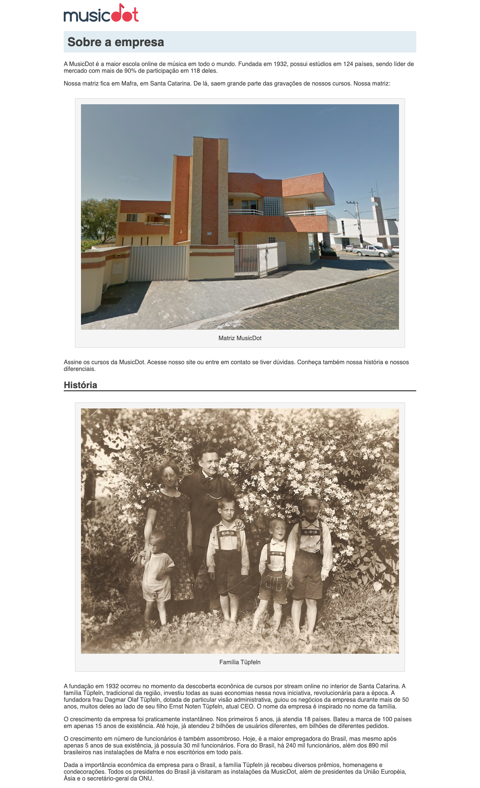

# Exercício: Trabalhando com tamanhos e espaçamento

## Objetivo
      
Nesse exercício trabalharemos com os tamanhos das caixas, com o espaço vazio entre essas caixas e com o espaço de respiro entre a caixa e seu conteúdo.

Em resumo, iremos:
- diminuir a largura do conteúdo da página para **940px** 
- Para que o conteúdo não fique colado no canto da página, afaste ele dos cantos direito e esquerdo da tela, até que fique centralizado.
- criar um espaço de respiro interno de **10px** para o conteúdo do título principal
- criar um espaço de respiro interno de **15px** para o conteúdo das figuras
- afastar **30px** as figuras dos cantos da tela e das caixas que vêm antes e depois delas
- dentro das figuras, afastar **10px** a legenda da imagem

A página ficará assim:



## Passo a passo com código

1. No arquivo **`sobre.css`** na pasta **`css`** faça as seguintes alterações:

    ###### # css/sobre.css
    ```css
     body {
    +  width: 940px;
    +  margin-left: auto;
    +  margin-right: auto;
    +
       font-family: "Helvetica", "Lucida Grande", sans-serif;
       color: #3D3D3D;
     }
     
     h1 {
    +  padding: 10px;
    +
       background-color: #E1EDF2;
     }
     
     h2 {
       border-bottom: 2px solid black;
     }
     
     figure {
    +  margin: 30px;
    +  padding: 15px;
    +  
       text-align: center;
     
       background-color: whitesmoke;
       border: 1px solid lightgrey;
     }
    +
    +figcaption {
    +  margin-top: 10px;
    +}
    ```
