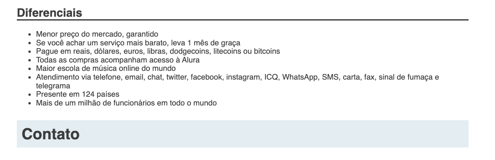

# Exercício: Usando classes para evitar acoplamento de estilos

## Objetivo
      
Adicionaremos uma nova seção com as informações de contato e começaremos colocando e estilizando apenas o título dessa nova seção.

O novo título de contato é na verdade um subtítulo da página e por isso usaremos uma tag `<h2>`. Porém, o estilo desse `<h2>` deve ser o mesmo da tag `<h1>` que temos na página. O desafio aqui é estilizar tanto o `<h1> Sobre a empresa </h1>` quanto o `<h2> Contato </h2>` sem repetir o código CSS para cada um e sem depender do nome da tag que usamos.

Uma dica é que podemos usar os tipos de seletores que vimos anteriormente para desacoplar nosso código CSS do HTML da página. Traduzindo, deixaremos de depender do nome das tags que escolhemos e passaremos a selecionar ambas as tags no CSS de uma forma mais específica e aplicaremos o mesmo estilo nas duas.

Para que esse estilo funcione, não poderemos mais estilizar todos os `<h2>` como fazemos agora. Será preciso também alterar os estilos genéricos de todo `<h2>` para que estilizem apenas os subtítulos `<h2> História </h2>` e `<h2> Diferenciais </h2>`

No final teremos o novo título aparecendo na página com o seguinte estilo:



## Passo a passo com código

1. No arquivo **`sobre.css`** na pasta **`css`** faça as seguintes alterações:

    ###### # css/sobre.css
    ```css
     body {
       width: 940px;
       margin-left: auto;
       margin-right: auto;
     
       font-family: "Helvetica", "Lucida Grande", sans-serif;
       color: #3D3D3D;
     }
     
    -h̶1̶ {̶
    +.titulo {
       padding: 10px;
     
    +  font-size: 32px;
    +
       background-color: #E1EDF2;
     }
     
    -h̶2̶ {̶
    +.subtitulo {
       border-bottom: 2px solid black;
     }
     
     figure {
       margin: 30px;
       padding: 15px;
       
       text-align: center;
     
       background-color: whitesmoke;
       border: 1px solid lightgrey;
     }
     
     figcaption {
       margin-top: 10px;
     }
     
     .matriz-musicdot {
       width: 550px;
       margin-left: auto;
       margin-right: auto;
     }
     
     .familia-tupfeln {
       width: 275px;
       float: right;
     }
     
     figure img {
       width: 100%;
     }
    ```

2. No arquivo **`sobre.html`** na pasta **`raíz do projeto`** faça as seguintes alterações:

    ###### # sobre.html
    ```html
     <!doctype html>
     <html lang="pt-BR">
       <head>
         <meta charset="utf-8">
         <title>
           MusicDot | Sobre a empresa
         </title>
         <link href="img/favicon.ico" rel="icon">
         <link rel="stylesheet" href="css/sobre.css">
       </head>
       
       <body>
         
         
     
    -    <̶h̶1̶>̶ S̶o̶b̶r̶e̶ a̶ e̶m̶p̶r̶e̶s̶a̶ <̶/̶h̶1̶>̶
    +    <h1 class="titulo"> Sobre a empresa </h1>
     
         <p>
           A MusicDot é a maior escola online de música em todo o mundo.
           Fundada em 1932, possui estúdios em 124 países, sendo líder de mercado com mais de 90% de
           participação em 118 deles.
         </p>
         
         <p>
           Nossa matriz fica em <a href="https://maps.google.com.br/?q=190,GabrielDequech,Mafra,SC"> Mafra, em Santa Catarina </a>. De lá, saem grande parte das gravações de nossos cursos. Nossa matriz:
         </p>
     
         <figure class="matriz-musicdot">
           
           <figcaption>
               Matriz MusicDot 
           </figcaption>
         </figure>
         
         <p>
           Assine os cursos da MusicDot. Acesse <a href="index.html"> nosso site </a> ou entre em contato
           se tiver dúvidas. Conheça também <a href="#historia"> nossa história </a> e <a href="#diferenciais"> nossos diferenciais </a>.
         </p>
     
    -    <̶h̶2̶ i̶d̶=̶"̶h̶i̶s̶t̶o̶r̶i̶a̶"̶>̶ H̶i̶s̶t̶ó̶r̶i̶a̶ <̶/̶h̶2̶>̶
    +    <h2 id="historia" class="subtitulo"> História </h2>
     
         <figure class="familia-tupfeln">
           
           <figcaption>Família Tüpfeln</figcaption>
         </figure>
         
         <p>
           A fundação em 1932 ocorreu no momento da descoberta econônica de cursos por stream online no interior de Santa Catarina. A
           família Tüpfeln, tradicional da região, investiu todas as suas economias nessa nova iniciativa,
           revolucionária para a época. A fundadora frau Dagmar Olaf Tüpfeln, dotada de particular visão
           administrativa, guiou os negócios da empresa durante mais de 50 anos, muitos deles ao lado
           de seu filho Ernst Noten Tüpfeln, atual CEO. O nome da empresa é inspirado no nome da família.
         </p>
         
         <p>
           O crescimento da empresa foi praticamente instantâneo. Nos primeiros 5 anos, já atendia 18 países.
           Bateu a marca de 100 países em apenas 15 anos de existência. Até hoje, já atendeu 2 bilhões
           de usuários diferentes, em bilhões de diferentes pedidos.
         </p>
         
         <p>
           O crescimento em número de funcionários é também assombroso. Hoje, é a maior empregadora do
           Brasil, mas mesmo após apenas 5 anos de sua existência, já possuía 30 mil funcionários. Fora do
           Brasil, há 240 mil funcionários, além dos 890 mil brasileiros nas instalações de Mafra e
           nos escritórios em todo país.
         </p>
         
         <p>
           Dada a importância econômica da empresa para o Brasil, a família Tüpfeln já recebeu diversos prêmios,
           homenagens e condecorações. Todos os presidentes do Brasil já visitaram as instalações da MusicDot, além de presidentes da União Européia, Ásia e o secretário-geral da ONU.
         </p>
     
    -    <̶h̶2̶ i̶d̶=̶"̶d̶i̶f̶e̶r̶e̶n̶c̶i̶a̶i̶s̶"̶>̶ D̶i̶f̶e̶r̶e̶n̶c̶i̶a̶i̶s̶ <̶/̶h̶2̶>̶
    +    <h2 id="diferenciais" class="subtitulo"> Diferenciais </h2>
         <ul>
           <li> Menor preço do mercado, garantido </li>
           <li> Se você achar um serviço mais barato, leva 1 mês de graça </li>
           <li> Pague em reais, dólares, euros, libras, dodgecoins, litecoins ou bitcoins </li>
           <li> Todas as compras acompanham acesso à Alura </li>
           <li> Maior escola de música online do mundo </li>
           <li> Atendimento via telefone, email, chat, twitter, facebook, instagram, ICQ, WhatsApp, SMS, carta, fax, sinal de fumaça e telegrama </li>
           <li> Presente em 124 países </li>
           <li> Mais de um milhão de funcionários em todo o mundo </li>
         </ul>
    +    
    +    <h2 class="titulo"> Contato </h2>
    +
       </body>
     </html>
    ```
