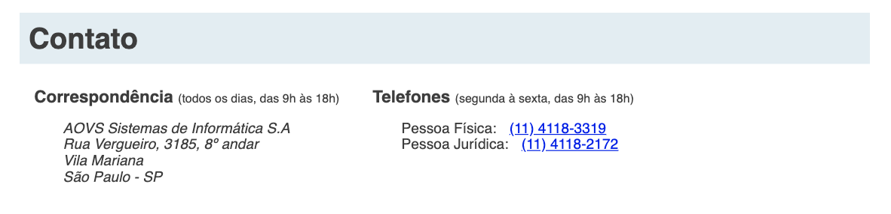
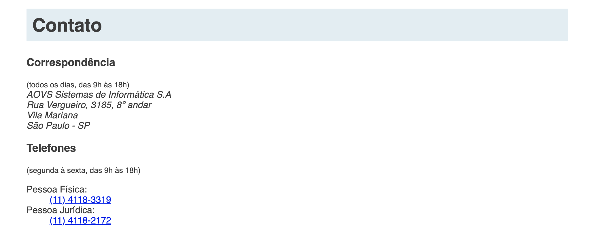

# Exercício: Semantica em primeiro lugar

## Objetivo
      
Agora continuaremos com o conteúdo da nova parte de "Contato" da página.

O resultado final com todos os estilos será o seguinte:



Nesse exercício não se preocupe em deixar a página com o mesmo estilo acima. Antes de mais nada, escreva o conteúdo da página e depois escolha as tags mais semânticas que você lembrar para cada parte do conteúdo.

O rodapé deve conter as seguintes informações:

    Uma seção com título "Correspondência" contendo:
    - o horário para recebimento de correspondências
    - um endereço para correspondência com:
        - Nome da empresa
        - Rua, núemro e andar
        - Bairro
        - Cidade - estado

    Uma seção com título "Telefones" contendo:
    - o horário para recebimento de ligações
    - Telefone de Pessoa Física
    - Telefone de Pessoa Jurídica

O conteúdo de texto está pronto em **"textos/sobre.txt"**

Ao final ainda não teremos os estilos como queremos, porém escolhendo as tags que trazem uma semântica legal teremos o seguinte resultado:



## Passo a passo com código

1. No arquivo **`sobre.html`** na pasta **`raíz do projeto`** faça as seguintes alterações:

    ###### # sobre.html
    ```html
     <!doctype html>
     <html lang="pt-BR">
       <head>
         <meta charset="utf-8">
         <title>
           MusicDot | Sobre a empresa
         </title>
         <link href="img/favicon.ico" rel="icon">
         <link rel="stylesheet" href="css/sobre.css">
       </head>
       
       <body>
         
         
     
         <h1 class="titulo"> Sobre a empresa </h1>
     
         <p>
           A MusicDot é a maior escola online de música em todo o mundo.
           Fundada em 1932, possui estúdios em 124 países, sendo líder de mercado com mais de 90% de
           participação em 118 deles.
         </p>
         
         <p>
           Nossa matriz fica em <a href="https://maps.google.com.br/?q=190,GabrielDequech,Mafra,SC"> Mafra, em Santa Catarina </a>. De lá, saem grande parte das gravações de nossos cursos. Nossa matriz:
         </p>
     
         <figure class="matriz-musicdot">
           
           <figcaption>
               Matriz MusicDot 
           </figcaption>
         </figure>
         
         <p>
           Assine os cursos da MusicDot. Acesse <a href="index.html"> nosso site </a> ou entre em contato
           se tiver dúvidas. Conheça também <a href="#historia"> nossa história </a> e <a href="#diferenciais"> nossos diferenciais </a>.
         </p>
     
         <h2 id="historia" class="subtitulo"> História </h2>
     
         <figure class="familia-tupfeln">
           
           <figcaption>Família Tüpfeln</figcaption>
         </figure>
         
         <p>
           A fundação em 1932 ocorreu no momento da descoberta econônica de cursos por stream online no interior de Santa Catarina. A
           família Tüpfeln, tradicional da região, investiu todas as suas economias nessa nova iniciativa,
           revolucionária para a época. A fundadora frau Dagmar Olaf Tüpfeln, dotada de particular visão
           administrativa, guiou os negócios da empresa durante mais de 50 anos, muitos deles ao lado
           de seu filho Ernst Noten Tüpfeln, atual CEO. O nome da empresa é inspirado no nome da família.
         </p>
         
         <p>
           O crescimento da empresa foi praticamente instantâneo. Nos primeiros 5 anos, já atendia 18 países.
           Bateu a marca de 100 países em apenas 15 anos de existência. Até hoje, já atendeu 2 bilhões
           de usuários diferentes, em bilhões de diferentes pedidos.
         </p>
         
         <p>
           O crescimento em número de funcionários é também assombroso. Hoje, é a maior empregadora do
           Brasil, mas mesmo após apenas 5 anos de sua existência, já possuía 30 mil funcionários. Fora do
           Brasil, há 240 mil funcionários, além dos 890 mil brasileiros nas instalações de Mafra e
           nos escritórios em todo país.
         </p>
         
         <p>
           Dada a importância econômica da empresa para o Brasil, a família Tüpfeln já recebeu diversos prêmios,
           homenagens e condecorações. Todos os presidentes do Brasil já visitaram as instalações da MusicDot, além de presidentes da União Européia, Ásia e o secretário-geral da ONU.
         </p>
     
         <h2 id="diferenciais" class="subtitulo"> Diferenciais </h2>
         <ul>
           <li> Menor preço do mercado, garantido </li>
           <li> Se você achar um serviço mais barato, leva 1 mês de graça </li>
           <li> Pague em reais, dólares, euros, libras, dodgecoins, litecoins ou bitcoins </li>
           <li> Todas as compras acompanham acesso à Alura </li>
           <li> Maior escola de música online do mundo </li>
           <li> Atendimento via telefone, email, chat, twitter, facebook, instagram, ICQ, WhatsApp, SMS, carta, fax, sinal de fumaça e telegrama </li>
           <li> Presente em 124 países </li>
           <li> Mais de um milhão de funcionários em todo o mundo </li>
         </ul>
         
         <h2 class="titulo"> Contato </h2>
     
    +    <h3> Correspondência </h3>
    +    <small> (todos os dias, das 9h às 18h) </small>
    +
    +    <address>
    +        AOVS Sistemas de Informática S.A
    +        <br>
    +        Rua Vergueiro, 3185, 8º andar
    +        <br>
    +        Vila Mariana
    +        <br>
    +        São Paulo - SP
    +    </address>
    +
    +    <h3> Telefones </h3>
    +    <small> (segunda à sexta, das 9h às 18h) </small>
    +    
    +    <dl>
    +      <dt> Pessoa Física: </dt>
    +      <dd> <a href="tel://114118-3319"> (11) 4118-3319 </a> </dd>
    +      
    +      <dt> Pessoa Jurídica: </dt>
    +      <dd> <a href="tel://114118-2172"> (11) 4118-2172 </a> </dd>
    +    </dl>
    +
       </body>
     </html>
    ```
