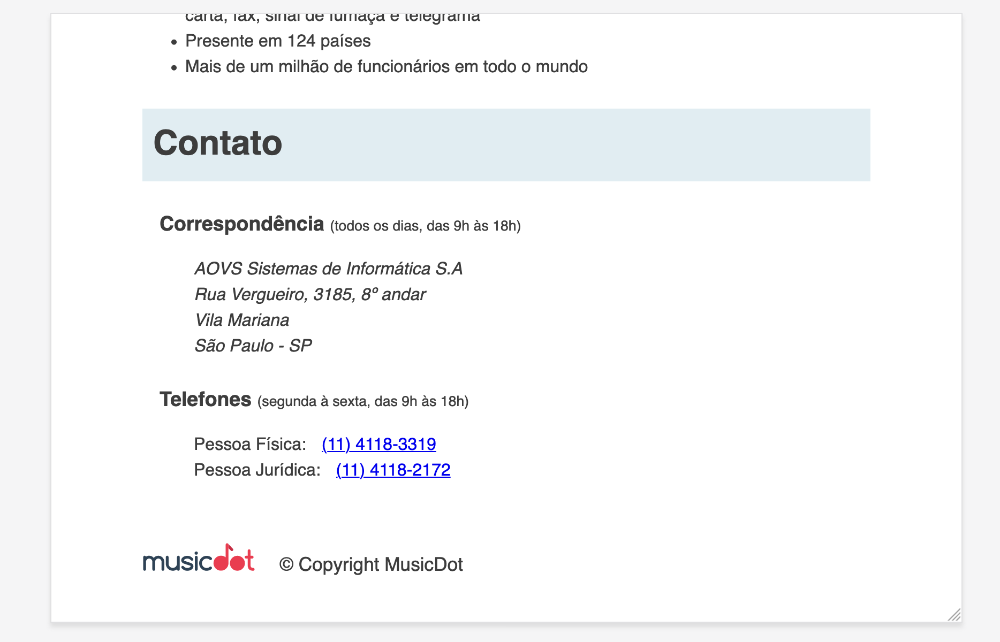
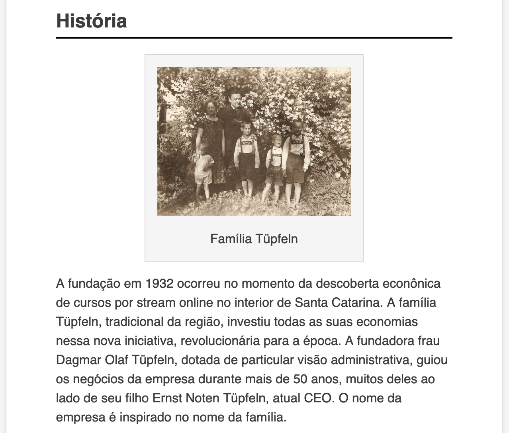
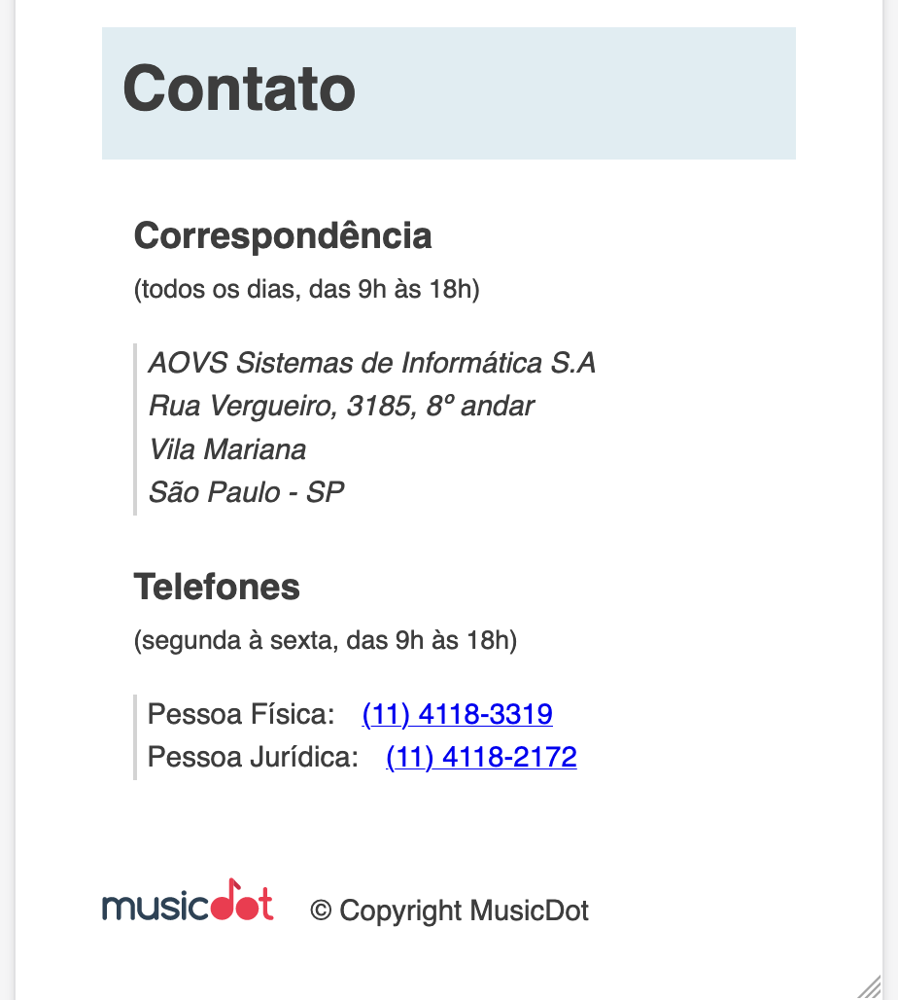
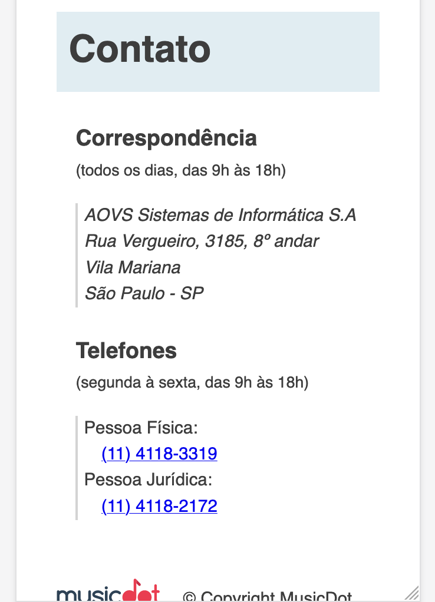

# Exercício: Responsividade com `@media`

## Objetivo
      
Utilize as media queries para definir estilos diferenciados de acordo com o tamanho da tela.

#### Para telas de **até 850px**
As seções "Correspondência" e "Telefones" na parte de "contato" já não cabem mais uma do lado da outra:
  - transforme as duas seções em blocos para que elas ocupem toda a largura disponível e não dividam o espaço na horizontal entre sí.
  - adicione também um espaçamento à esquerda do tamanho de um caractér nessas mesmas seções.



#### Para telas de **até 622px**
* O texto que fica ao redor da imagem da família Tupfeln já não tem mais espaço para mais do que duas palavras:
  - faça com que a `<figure>` da família deixe de flutuar para que os textos voltem a ficar apenas embaixo da figura.
  - centralize a figura na horizontal, em relação à pagina.

  

#### Para telas de **até 446px**
* Os subtítulos dentro de "contato" não cabem mais na mesma linha junto com os horários:
  - Faça com que cada subtítulo desses vire um bloco, que ocupe a linha toda e faça a linha com os horários ir para baixo.
* As informação dentro de cada seção de "contato" já não cabem mais na tela: 
  - substitua a margem à esquerda por uma borda de **1px** **cinza-claro** à esquerda. 
  - coloque um espaçamento interno à esquerda de **5px**
  - deixe a fonte levemente menor (`0.92em`) do que o tamanho da fonta da página
* O conteúdo do rodapé já não cabe mais numa linha só:
  - deixe a fonte levemente menor do que a que a fonte da página (`0.92em`).

  

#### Para telas de **até 342px**
Os números dos telefones estão no limite e quase já não cabem na mesma linha que sua descrição:
  * deixe os título da `<dl>` dos telefones como bloco para que ocupem a linha toda
  * coloque um espaçamento à esquerda para dar a ideia de hierarquia entre título e número de telefone



## Passo a passo com código

1. No arquivo **`sobre.css`** na pasta **`css`** faça as seguintes alterações:

    ###### # css/sobre.css
    ```css
     body {
       width: 80%;
       max-width: 940px;
       margin-left: auto;
       margin-right: auto;
     
       font-size: 16px;
       line-height: 1.5;
       font-family: "Helvetica", "Lucida Grande", sans-serif;
       color: #3D3D3D;
     }
     
     .titulo {
       padding: 10px;
     
       font-size: 32px;
     
       background-color: #E1EDF2;
     }
     
     .subtitulo {
       border-bottom: 2px solid black;
     }
     
     figure {
       max-width: 100%;
       box-sizing: border-box;
       margin: 30px;
       padding: 15px;
       
       text-align: center;
     
       background-color: whitesmoke;
       border: 1px solid lightgrey;
     }
     
     figcaption {
       margin-top: 10px;
     }
     
     .matriz-musicdot {
       width: 550px;
       margin-left: auto;
       margin-right: auto;
     }
     
     .familia-tupfeln {
       width: 275px;
       float: right;
     }
     
     figure img {
       width: 100%;
     }
     
     .contato__subtitulo {
       display: inline;
     }
     
     .contato__secao {
       display: inline-block;
       vertical-align: top;
       margin-left: 16px;
     }
     
     .contato__secao--telefone {
       margin-left: 32px;
     }
     
     .contato__info {
       margin: 16px 0 24px;
       padding-left: 32px;
     }
     
     .contato__info-titulo,
     .contato__info-descricao {
       display: inline;
     }
     
     .contato__info-descricao {
       margin-left: 10px;
     }
     
     .rodape {
       padding: 1.75em 0;
     
       font-size: 1.1rem;
     }
     
     .rodape__logo {
       width: 6em;
     }
     
     .rodape__copyright {
       display: inline;
       margin-left: 1em;
     }
    +
    +@media (max-width: 850px) {
    +
    +  .contato__secao {
    +    display: block;
    +    margin-left: 1em;
    +  }
    +
    +}
    +
    +@media (max-width: 622px) {
    +
    +  .familia-tupfeln {
    +    float: none;
    +    margin: 0 auto;
    +  }
    +
    +}
    +
    +@media (max-width: 446px) {
    +
    +  .contato__subtitulo {
    +    display: block;
    +    margin-bottom: 0;
    +  }
    +
    +  .contato__info {
    +    padding-left: 5px;
    +    
    +    font-size: .92em;
    +
    +    border-left: 2px solid lightgray;
    +  }
    +
    +  .rodape {
    +    font-size: .92em;
    +  }
    +
    +}
    +
    +@media (max-width: 342px) {
    +
    +  .contato__info-descricao {
    +    display: block;
    +    margin-left: 1em;
    +  }
    +
    +}
    ```
