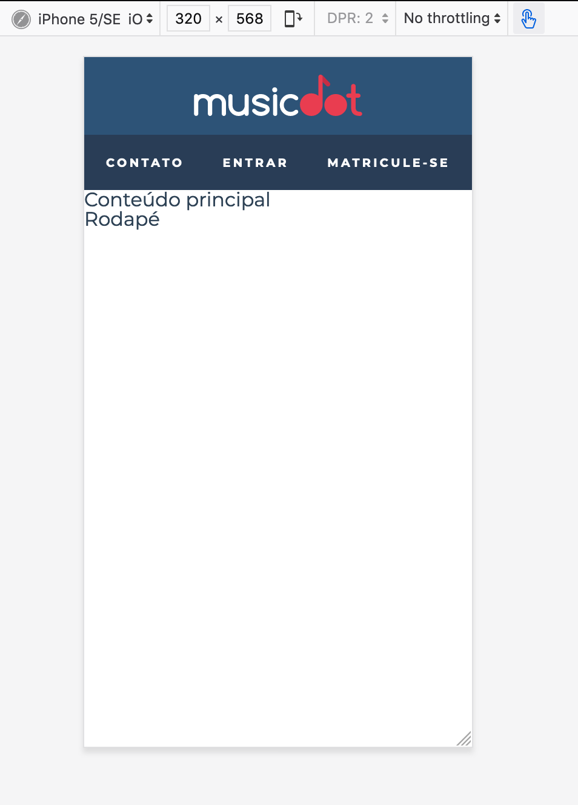
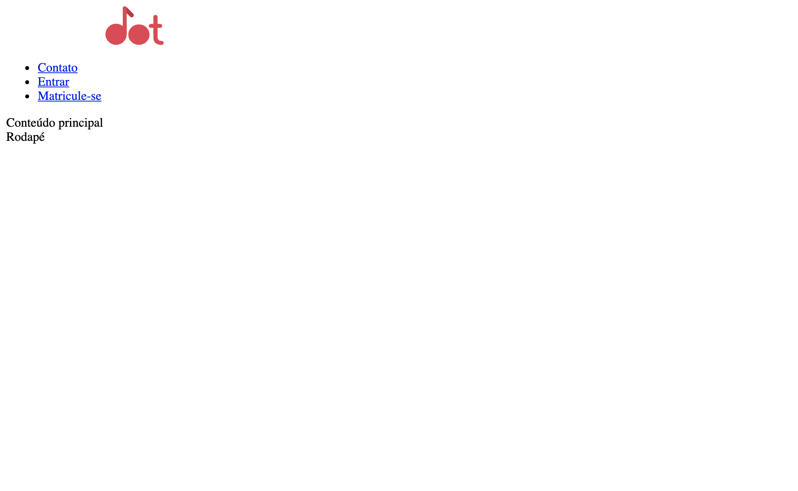
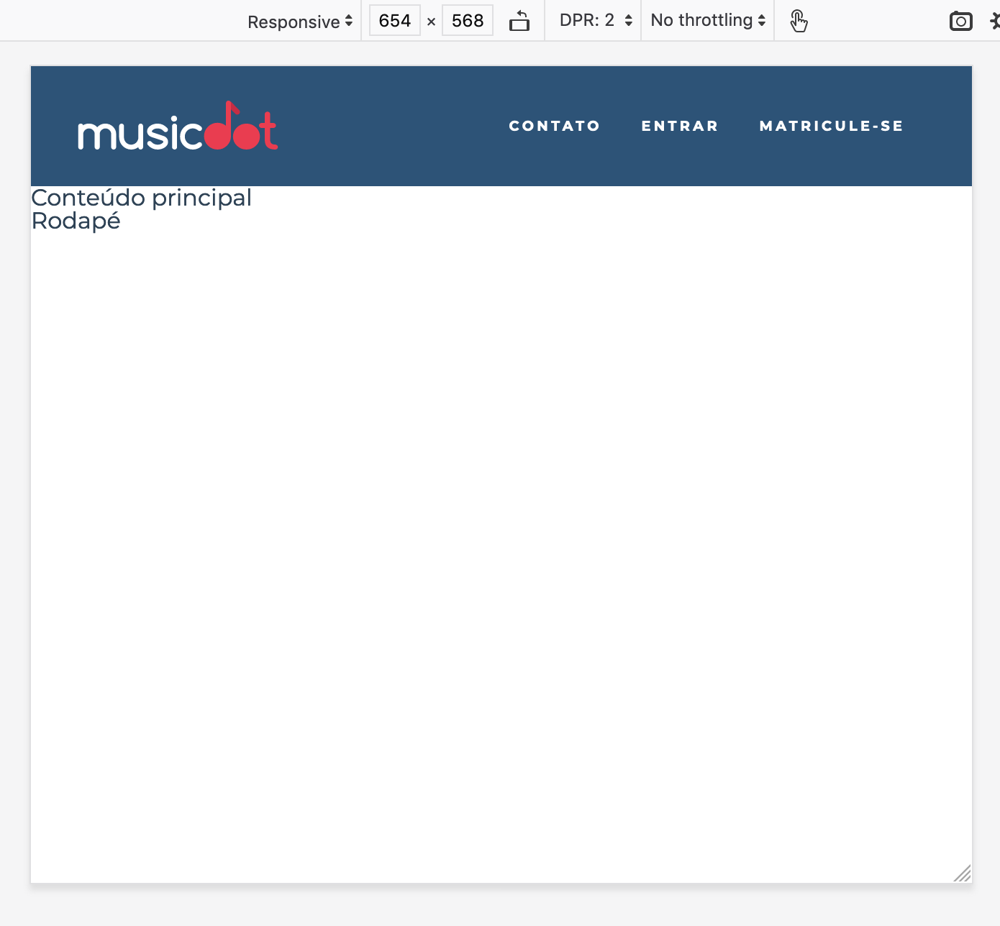
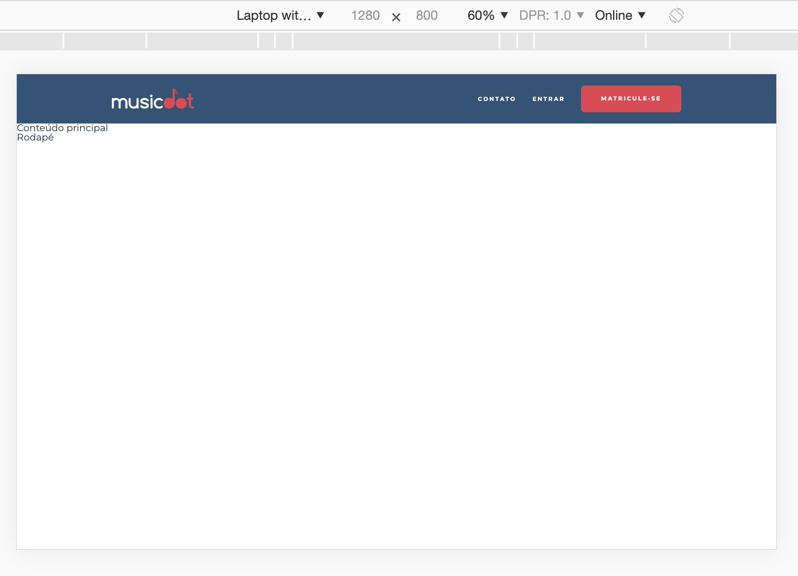

# Exercício: Estrutura da página principal e o cabeçalho

## Objetivo
      
Começaremos agora a página principal da MusicDot.

Edite o arquivo `index.html` que criamos anteriormente (se não criou antes, é só criar agora) e coloque toda a estrutura básica de um arquivo *HTML* e também aproveite para criar toda a estrutura do cabeçalho da home. No link de "Contato" do menu do cabeçalho, aponte para a parte de contato na página `sobre.html`.

Num celular o cabeçalho terá a seguite aparência:



Não se preocupe em criar os nomes das classes e estilizar ainda. Sem estilos o resultado final será próximon a esse:



Nos próximos exercícios contruiremos um cabeçalho responsivo param vários tamanhos de tela:






## Passo a passo com código

1. No arquivo **`index.html`** na pasta **`raíz do projeto`** faça as seguintes alterações:

    ###### # index.html
    ```html
    -<̶h̶1̶>̶ P̶á̶g̶i̶n̶a̶ p̶r̶i̶n̶c̶i̶p̶a̶l̶ t̶e̶m̶p̶o̶r̶á̶r̶i̶a̶ d̶a̶ M̶u̶s̶i̶c̶D̶o̶t̶ <̶/̶h̶1̶>̶
    +<!doctype html>
    +<html>
    +  <head>
    +    <meta charset="utf-8">
    +    <meta name="viewport" content="width=device-width">
    +    <title>Musicdot</title>
    +    <link rel="icon" href="img/favicon.ico">
    +  </head>
    +  <body>
    +
    +    <header>
    +      <a href="index.html">
    +        
    +      </a>
    +      
    +      <nav>
    +        <ul>
    +          <li> <a href="sobre.html#contato"> Contato </a> </li>
    +          <li> <a href="#"> Entrar </a> </li>
    +          <li> <a href="#"> Matricule-se </a> </li>
    +        </ul>
    +      </nav>
    +    </header>
    +
    +    <main>
    +      Conteúdo principal
    +    </main>
    +
    +    <footer>
    +      Rodapé
    +    </footer>
    +  </body>
    +</html>
    ```

2. No arquivo **`sobre.html`** na pasta **`raíz do projeto`** faça as seguintes alterações:

    ###### # sobre.html
    ```html
     <!doctype html>
     <html lang="pt-BR">
       <head>
         <meta charset="utf-8">
         <meta name="viewport" content="width=device-width">
         <title>
           MusicDot | Sobre a empresa
         </title>
         <link href="img/favicon.ico" rel="icon">
         <link rel="stylesheet" href="css/sobre.css">
       </head>
       
       <body>
         
         
     
         <h1 class="titulo"> Sobre a empresa </h1>
     
         <p>
           A MusicDot é a maior escola online de música em todo o mundo.
           Fundada em 1932, possui estúdios em 124 países, sendo líder de mercado com mais de 90% de
           participação em 118 deles.
         </p>
         
         <p>
           Nossa matriz fica em <a href="https://maps.google.com.br/?q=190,GabrielDequech,Mafra,SC"> Mafra, em Santa Catarina </a>. De lá, saem grande parte das gravações de nossos cursos. Nossa matriz:
         </p>
     
         <figure class="matriz-musicdot">
           
           <figcaption>
               Matriz MusicDot 
           </figcaption>
         </figure>
         
         <p>
           Assine os cursos da MusicDot. Acesse <a href="index.html"> nosso site </a> ou entre em contato
           se tiver dúvidas. Conheça também <a href="#historia"> nossa história </a> e <a href="#diferenciais"> nossos diferenciais </a>.
         </p>
     
         <h2 id="historia" class="subtitulo"> História </h2>
     
         <figure class="familia-tupfeln">
           
           <figcaption>Família Tüpfeln</figcaption>
         </figure>
         
         <p>
           A fundação em 1932 ocorreu no momento da descoberta econônica de cursos por stream online no interior de Santa Catarina. A
           família Tüpfeln, tradicional da região, investiu todas as suas economias nessa nova iniciativa,
           revolucionária para a época. A fundadora frau Dagmar Olaf Tüpfeln, dotada de particular visão
           administrativa, guiou os negócios da empresa durante mais de 50 anos, muitos deles ao lado
           de seu filho Ernst Noten Tüpfeln, atual CEO. O nome da empresa é inspirado no nome da família.
         </p>
         
         <p>
           O crescimento da empresa foi praticamente instantâneo. Nos primeiros 5 anos, já atendia 18 países.
           Bateu a marca de 100 países em apenas 15 anos de existência. Até hoje, já atendeu 2 bilhões
           de usuários diferentes, em bilhões de diferentes pedidos.
         </p>
         
         <p>
           O crescimento em número de funcionários é também assombroso. Hoje, é a maior empregadora do
           Brasil, mas mesmo após apenas 5 anos de sua existência, já possuía 30 mil funcionários. Fora do
           Brasil, há 240 mil funcionários, além dos 890 mil brasileiros nas instalações de Mafra e
           nos escritórios em todo país.
         </p>
         
         <p>
           Dada a importância econômica da empresa para o Brasil, a família Tüpfeln já recebeu diversos prêmios,
           homenagens e condecorações. Todos os presidentes do Brasil já visitaram as instalações da MusicDot, além de presidentes da União Européia, Ásia e o secretário-geral da ONU.
         </p>
     
         <h2 id="diferenciais" class="subtitulo"> Diferenciais </h2>
         <ul>
           <li> Menor preço do mercado, garantido </li>
           <li> Se você achar um serviço mais barato, leva 1 mês de graça </li>
           <li> Pague em reais, dólares, euros, libras, dodgecoins, litecoins ou bitcoins </li>
           <li> Todas as compras acompanham acesso à Alura </li>
           <li> Maior escola de música online do mundo </li>
           <li> Atendimento via telefone, email, chat, twitter, facebook, instagram, ICQ, WhatsApp, SMS, carta, fax, sinal de fumaça e telegrama </li>
           <li> Presente em 124 países </li>
           <li> Mais de um milhão de funcionários em todo o mundo </li>
         </ul>
         
         <h2 class="titulo"> Contato </h2>
     
         <div class="contato__secao">
           <h3 class="contato__subtitulo"> Correspondência </h3>
           <small> (todos os dias, das 9h às 18h) </small>
       
           <address class="contato__info">
               AOVS Sistemas de Informática S.A
               <br>
               Rua Vergueiro, 3185, 8º andar
               <br>
               Vila Mariana
               <br>
               São Paulo - SP
           </address>
         </div>
     
    -    <̶d̶i̶v̶ c̶l̶a̶s̶s̶=̶"̶c̶o̶n̶t̶a̶t̶o̶_̶_̶s̶e̶c̶a̶o̶ c̶o̶n̶t̶a̶t̶o̶_̶_̶s̶e̶c̶a̶o̶-̶-̶t̶e̶l̶e̶f̶o̶n̶e̶"̶>̶
    +    <div id="contato" class="contato__secao contato__secao--telefone">
           <h3 class="contato__subtitulo"> Telefones </h3>
           <small> (segunda à sexta, das 9h às 18h) </small>
           
           <dl class="contato__info">
             <div>
               <dt class="contato__info-titulo"> Pessoa Física: </dt>
               <dd class="contato__info-descricao"> <a href="tel://114118-3319"> (11) 4118-3319 </a> </dd>
             </div>
           
             <div>
               <dt class="contato__info-titulo"> Pessoa Jurídica: </dt>
               <dd class="contato__info-descricao"> <a href="tel://114118-2172"> (11) 4118-2172 </a> </dd>
             </div>
           </dl>
         </div>
     
         <footer class="rodape">
           
           <p class="rodape__copyright"> &copy; Copyright MusicDot </p>
         </footer>
     
       </body>
     </html>
    ```
