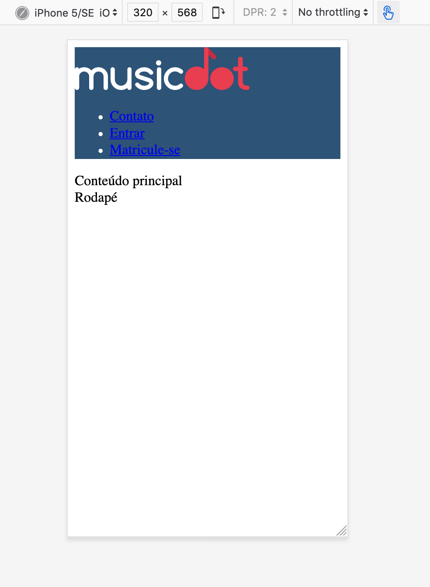
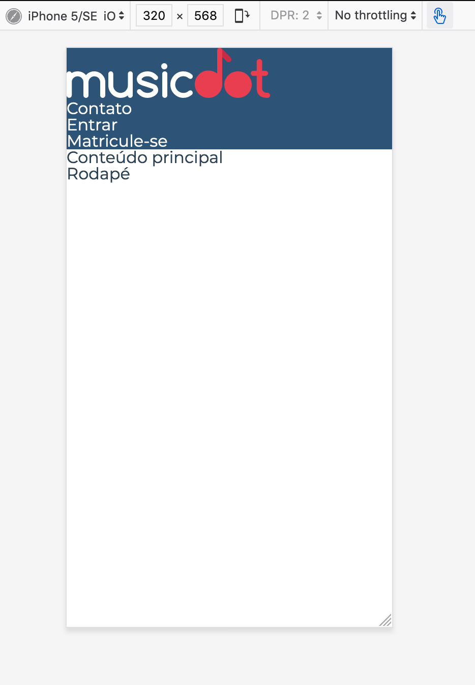

# Exercício: Começando a estilizar o `header` da home

## Objetivo
      
Nessa página seguiremos uma organização de arquivos CSS onde cada bloco do BEM terá seu próprio arquivo CSS.

Iniciaremos os estilos em **cabecalho.css** alterando sua cor de fundo para um azul-escuro **"#2D5377"** e a cor do conteúdo para branco **"#FFF"**. 

Ao fazer isso, note que os links não mudam sua cor para branco e que há um espaçamento que não colocamos entre a página e o cabeçalho:



Para solucionar precisaremos adicionar um CSS que retire os estilos padrão do navegador. Chamamos esse tipi de estilo de *reset*. O *reset* que usaremos está parcialmente pronto e está disponível em [https://meyerweb.com/eric/tools/css/reset/reset.css](https://meyerweb.com/eric/tools/css/reset/reset.css).

Adicionaremos mais alguns estilos nesse reset:
  * alteraremos a fonte padrão de todo texto na página pela fonte **`Montserrat`**
  * todo texto na página por padrão terá a cor **`#2e4255`**
  * todo link terá a cor herdada da cor da fonte do seu parente
  * todo link terá a decoração de texto (e.g. underline) herdada de seu parente

Para que a fonte Montserrat funcione mesmo em computadores que não tenham ela instalada, precisaremos baixar e criar essa família de fontes com CSS. Por enquanto, usaremos esse CSS pronto de um serviço chamado Google Fonts, em: [https://fonts.googleapis.com/css?family=Montserrat:300,400,500,600,700,&display=block](https://fonts.googleapis.com/css?family=Montserrat:300,400,500,600,700,&display=block). Nesse endereço há um arquivo CSS com tudo pronto, basta importá-lo como um arquivo CSS na página.

O resultado final será o seguinte:



## Passo a passo com código

1. Crie o arquivo **`cabecalho.css`** na pasta **`css`** com o seguinte código:

    ###### # css/cabecalho.css
    ```css
    +.cabecalho {
    +  background-color: #2D5377;
    +  color: #fff;
    +}
    ```

2. No arquivo **`index.html`** na pasta **`raíz do projeto`** faça as seguintes alterações:

    ###### # index.html
    ```html
     <!doctype html>
     <html>
       <head>
         <meta charset="utf-8">
         <meta name="viewport" content="width=device-width">
         <title>Musicdot</title>
         <link rel="icon" href="img/favicon.ico">
    +    <link rel="stylesheet" href="https://fonts.googleapis.com/css?family=Montserrat:300,400,500,600,700,&display=block">
    +    <link rel="stylesheet" href="css/reset.css">
    +    <link rel="stylesheet" href="css/cabecalho.css">
       </head>
       <body>
     
    -    <̶h̶e̶a̶d̶e̶r̶>̶
    +    <header class="cabecalho">
           <a href="index.html">
             
           </a>
           
           <nav>
             <ul>
               <li> <a href="sobre.html#contato"> Contato </a> </li>
               <li> <a href="#"> Entrar </a> </li>
               <li> <a href="#"> Matricule-se </a> </li>
             </ul>
           </nav>
         </header>
     
         <main>
           Conteúdo principal
         </main>
     
         <footer>
           Rodapé
         </footer>
       </body>
     </html>
    ```

3. No arquivo **`reset.css`** na pasta **`css`** faça as seguintes alterações:

    ###### # css/reset.css
    ```css
     /* http://meyerweb.com/eric/tools/css/reset/ 
        v2.0 | 20110126
        License: none (public domain)
     */
     
     html, body, div, span, applet, object, iframe,
     h1, h2, h3, h4, h5, h6, p, blockquote, pre,
     a, abbr, acronym, address, big, cite, code,
     del, dfn, em, img, ins, kbd, q, s, samp,
     small, strike, strong, sub, sup, tt, var,
     b, u, i, center,
     dl, dt, dd, ol, ul, li,
     fieldset, form, label, legend,
     table, caption, tbody, tfoot, thead, tr, th, td,
     article, aside, canvas, details, embed, 
     figure, figcaption, footer, header, hgroup, 
     menu, nav, output, ruby, section, summary,
     time, mark, audio, video {
     	margin: 0;
     	padding: 0;
     	border: 0;
     	font-size: 100%;
     	font: inherit;
     	vertical-align: baseline;
     }
     /* HTML5 display-role reset for older browsers */
     article, aside, details, figcaption, figure, 
     footer, header, hgroup, menu, nav, section {
     	display: block;
     }
     body {
     	line-height: 1;
     }
     ol, ul {
     	list-style: none;
     }
     blockquote, q {
     	quotes: none;
     }
     blockquote:before, blockquote:after,
     q:before, q:after {
     	content: '';
     	content: none;
     }
     table {
     	border-collapse: collapse;
     	border-spacing: 0;
     }
    +
    +body {
    +  font-family: 'Montserrat', sans-serif;
    +  color: #2e4255;
    +}
    +
    +a {
    +  color: inherit;
    +  text-decoration: inherit;
    +}
    ```
