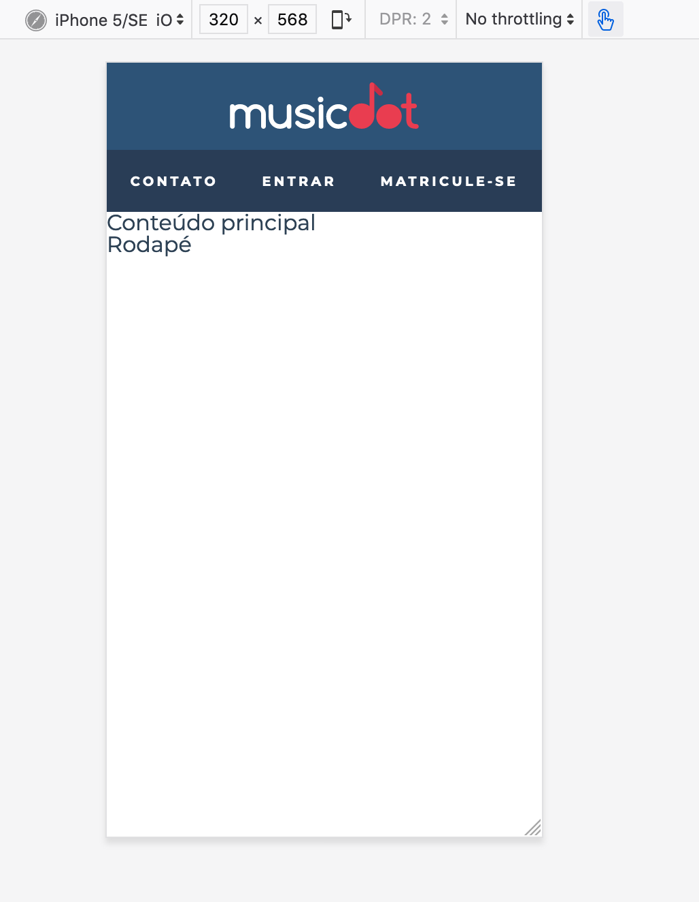

# Exercício: Progressive Enhancement

## Objetivo
      
Durante todo o curso aplicaremos um conceito chamado de Progressive Enhancement. O P.E. vai permear todos os nossos códigos.

  Nesse primeiro momento, o que é importante para nós:

  - Escolher uma marcação semântica que ajude quem está desenvolvendo o site a se guiar pelo código, geralmente já ajuda na acessibilidade de leitores de tela.
  - Testar semântica em leitores de tela (NVDA) ou em ferramentas de acessibilidade (Dev tools do Firefox).
  - Desenvolver com device-mode aberto no mobile. Telas menores primeiro: *mobile-first*
  - Ainda no device-mode deixar o modo de touch habilitado (escolher um celular como dispositivo) 

  Iniciaremos todo o estilo do cabeçalho com o *Device Mode* do navegador já configurado para uma tela de celular. O resultado esperado é o seguinte:

  

  - Para facilitar os cliques nos items do menu, para quem usa pointer com menor precisão (e.g. toucshscreen), aumentaremos a área clicável de cada link do menu, colocando um espaçamento interno de **`1.86em 1.42em`**.

  - Diminuiremos o tamanho da fonte no cabecalho, porém, ainda deixaremos o texto legível para baixa visão:
    * deixar tudo com letras maiúsculas preservando a semântica do conteúdo
    * aumentar o espaçamento entre as letras
    * melhorar o contraste escurencendo a cor de fundo do menu com um cinza-escuro-transparente: **`#272B3A87`**
    * verifique o suporte do padrão de cores **`#rrggbbaa`** em https://caniuse.com/#search=rrggbbaa e use uma alternativa caso ache necessário

  - Usar o layout padrão do CSS ao nosso favor, deixando tudo como está e alterando apenas o alinhamento do conteúdo do cabeçalho

## Passo a passo com código

1. No arquivo **`cabecalho.css`** na pasta **`css`** faça as seguintes alterações:

    ###### # css/cabecalho.css
    ```css
     .cabecalho {
    -  b̶a̶c̶k̶g̶r̶o̶u̶n̶d̶-̶c̶o̶l̶o̶r̶:̶ #̶2̶D̶5̶3̶7̶7̶;̶
    +  text-align: center;
    +  font-size: 0.6rem;
    +  font-weight: bold;
    +  text-transform: uppercase;
    +  letter-spacing: 0.23em;
    +
       color: #fff;
    +  background-color: #2D5377;
    +}
    +
    +.cabecalho__logo {
    +  padding: 1.5em 0;
    +  width: 14.5em;
    +}
    +
    +.cabecalho__menu {
    +  background-color: #272B3A87;
    +}
    +
    +.cabecalho__item-menu {
    +  display: inline-block;
    +}
    +
    +.cabecalho__item-menu a {
    +  display: inline-block;
    +  padding: 1.86em 1.42em;
     }
    ```

2. No arquivo **`index.html`** na pasta **`raíz do projeto`** faça as seguintes alterações:

    ###### # index.html
    ```html
     <!doctype html>
     <html>
       <head>
         <meta charset="utf-8">
         <meta name="viewport" content="width=device-width">
         <title>Musicdot</title>
         <link rel="icon" href="img/favicon.ico">
         <link rel="stylesheet" href="https://fonts.googleapis.com/css?family=Montserrat:300,400,500,600,700,&display=block">
         <link rel="stylesheet" href="css/reset.css">
         <link rel="stylesheet" href="css/cabecalho.css">
       </head>
       <body>
     
         <header class="cabecalho">
           <a href="index.html">
    -        <̶i̶m̶g̶ s̶r̶c̶=̶"̶i̶m̶g̶/̶m̶u̶s̶i̶c̶d̶o̶t̶-̶l̶o̶g̶o̶-̶l̶i̶g̶h̶t̶.̶s̶v̶g̶"̶ t̶i̶t̶l̶e̶=̶"̶I̶r̶ p̶a̶r̶a̶ a̶ p̶á̶g̶i̶n̶a̶ i̶n̶i̶c̶i̶a̶l̶ d̶a̶ M̶u̶s̶i̶c̶d̶o̶t̶"̶ a̶l̶t̶=̶"̶M̶u̶s̶i̶c̶d̶o̶t̶"̶>̶
    +        
           </a>
           
           <nav>
    -        <̶u̶l̶>̶
    -          <̶l̶i̶>̶ <̶a̶ h̶r̶e̶f̶=̶"̶s̶o̶b̶r̶e̶.̶h̶t̶m̶l̶#̶c̶o̶n̶t̶a̶t̶o̶"̶>̶ C̶o̶n̶t̶a̶t̶o̶ <̶/̶a̶>̶ <̶/̶l̶i̶>̶
    -          <̶l̶i̶>̶ <̶a̶ h̶r̶e̶f̶=̶"̶#̶"̶>̶ E̶n̶t̶r̶a̶r̶ <̶/̶a̶>̶ <̶/̶l̶i̶>̶
    -          <̶l̶i̶>̶ <̶a̶ h̶r̶e̶f̶=̶"̶#̶"̶>̶ M̶a̶t̶r̶i̶c̶u̶l̶e̶-̶s̶e̶ <̶/̶a̶>̶ <̶/̶l̶i̶>̶
    +        <ul class="cabecalho__menu">
    +          <li class="cabecalho__item-menu"> <a href="sobre.html#contato"> Contato </a> </li>
    +          <li class="cabecalho__item-menu"> <a href="#"> Entrar </a> </li>
    +          <li class="cabecalho__item-menu"> <a href="#"> Matricule-se </a> </li>
             </ul>
           </nav>
         </header>
     
         <main>
           Conteúdo principal
         </main>
     
         <footer>
           Rodapé
         </footer>
       </body>
     </html>
    ```
