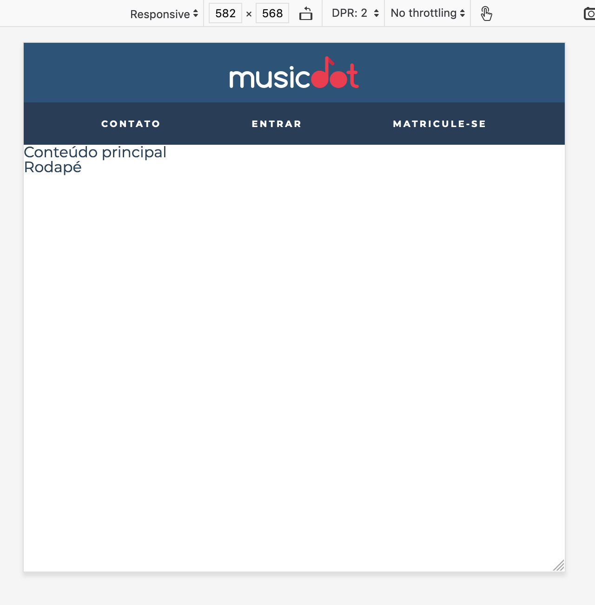

# Exercício: Novos Layouts com Flexbox

## Objetivo
      
Com a nova ideia de layouts mais declarativos com Flexbox, faremos com que os itens do menu do cabeçalho sejam distribuídos igualmente por toda largura do cabeçalho. As margem horizontal entre os itens deixará de ser fixa:



## Passo a passo com código

1. No arquivo **`cabecalho.css`** na pasta **`css`** faça as seguintes alterações:

    ###### # css/cabecalho.css
    ```css
     .cabecalho {
       text-align: center;
       font-size: 0.6rem;
       font-weight: bold;
       text-transform: uppercase;
       letter-spacing: 0.23em;
     
       color: #fff;
       background-color: #2D5377;
     }
     
     .cabecalho__logo {
       padding: 1.5em 0;
       width: 14.5em;
     }
     
     .cabecalho__menu {
    +  display: flex;
    +  justify-content: space-evenly;
    +  flex-wrap: wrap;
    +
       background-color: #272B3A87;
     }
     
     .cabecalho__item-menu {
       display: inline-block;
     }
     
     .cabecalho__item-menu a {
       display: inline-block;
       padding: 1.86em 1.42em;
     }
    ```
