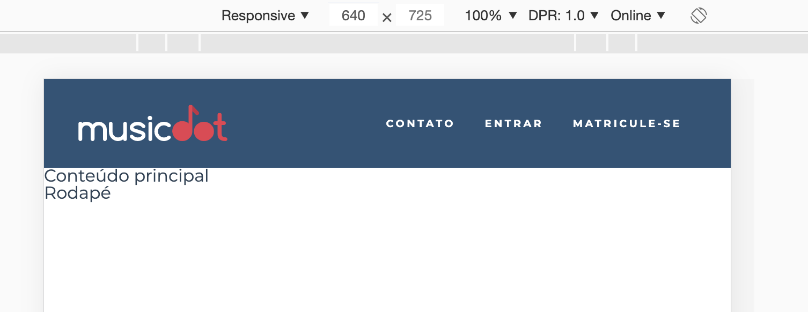

# Exercício: Novos Layouts com Flexbox B

## Objetivo
      
Ainda com a nova ideia de layouts mais declarativos com Flexbox, faremos com que em telas com larguras a partir de **`640px`**  o logo e o menu fiquem um do lado do outro com o máximo de espaço possível entre eles. O logo ficaria o máximo possível para a direita e o menu o máximo possível para a esquerda. Dizemos que eles ficarão justificados:



## Passo a passo com código

1. No arquivo **`cabecalho.css`** na pasta **`css`** faça as seguintes alterações:

    ###### # css/cabecalho.css
    ```css
     .cabecalho {
       text-align: center;
       font-size: 0.6rem;
       font-weight: bold;
       text-transform: uppercase;
       letter-spacing: 0.23em;
     
       color: #fff;
       background-color: #2D5377;
     }
     
     .cabecalho__logo {
       padding: 1.5em 0;
       width: 14.5em;
     }
     
     .cabecalho__menu {
       display: flex;
       justify-content: space-evenly;
       flex-wrap: wrap;
     
       background-color: #272B3A87;
     }
     
     .cabecalho__item-menu {
       display: inline-block;
     }
     
     .cabecalho__item-menu a {
       display: inline-block;
       padding: 1.86em 1.42em;
     }
    +
    +@media (min-width: 640px) {
    +  .cabecalho {
    +    padding: 0 5%;
    +    display: flex;
    +    justify-content: space-between;
    +    align-items: center;
    +  }
    +
    +  .cabecalho__logo {
    +    padding: 2.5em 0;
    +  }
    +
    +  .cabecalho__menu {
    +    background-color: transparent; 
    +  }
    +}
    ```
