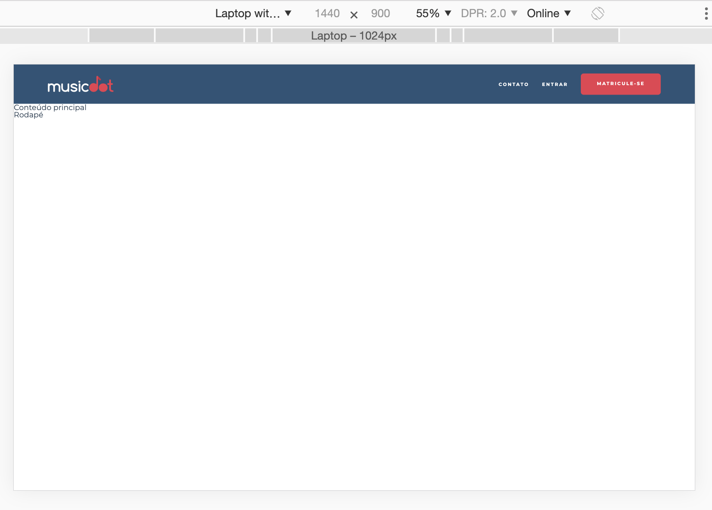
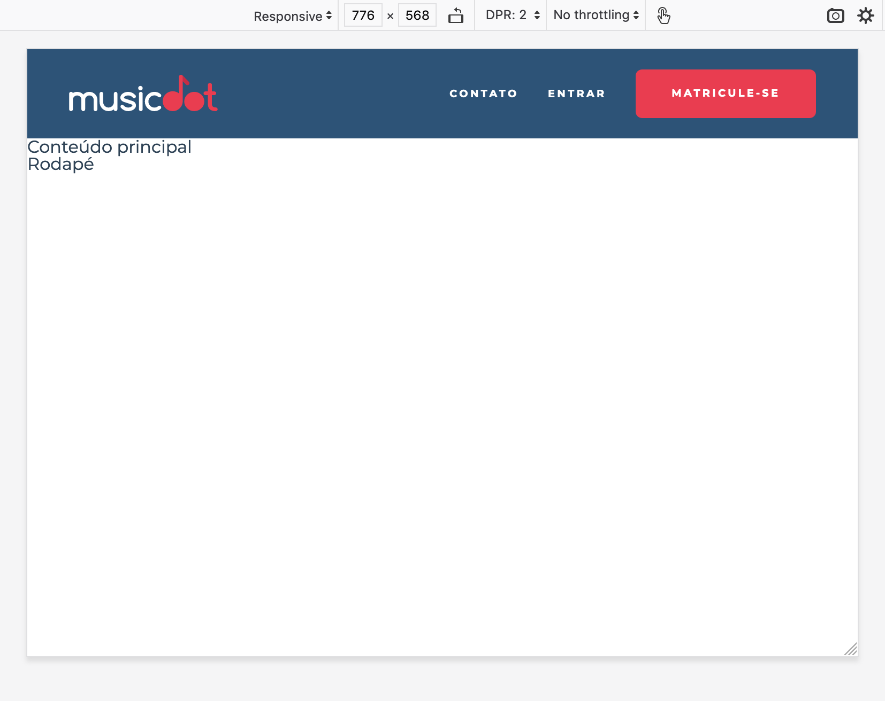

# Exercício: Responsividade e fallback

## Objetivo
      
Em telas grandes e com alta resolução, o padding horizontal em porcentagem que colocamos no cabeçalho pode não ser o suficiente e acabaremos com um cabeçalho largo demais:



Para solucionar esse problema calcularemos um padding dinâmico, que garantirá que o conteúdo do cabeçalho ocupará sempre no máximo **`960px`**, isso para qualquer tela maior que **`1066px`**.

Outro ponto que podemos melhorar é dando um destaque para o item "Matricule-se" do menu. Deixaremos ele com o fundo vermelho **`#e93d50`**, com um espaçamento à esquerda de **`1.42em`** e uma borda redonda com raio de  **`6px`**.



## Passo a passo com código

1. No arquivo **`cabecalho.css`** na pasta **`css`** faça as seguintes alterações:

    ###### # css/cabecalho.css
    ```css
     .cabecalho {
       text-align: center;
       font-size: 0.6rem;
       font-weight: bold;
       text-transform: uppercase;
       letter-spacing: 0.23em;
     
       color: #fff;
       background-color: #2D5377;
     }
     
     .cabecalho__logo {
       padding: 1.5em 0;
       width: 14.5em;
     }
     
     .cabecalho__menu {
       display: flex;
       justify-content: space-evenly;
       flex-wrap: wrap;
     
       background-color: #272B3A87;
     }
     
     .cabecalho__item-menu {
       display: inline-block;
     }
     
     .cabecalho__item-menu a {
       display: inline-block;
       padding: 1.86em 1.42em;
     }
     
     @media (min-width: 640px) {
       .cabecalho {
         padding: 0 5%;
         display: flex;
         justify-content: space-between;
         align-items: center;
       }
     
       .cabecalho__logo {
         padding: 2.5em 0;
       }
     
       .cabecalho__menu {
         background-color: transparent; 
       }
     }
    +
    +@media (min-width: 770px) {
    +  .cabecalho__item-menu--matricular {
    +    margin-left: 1.42em;
    +
    +    border-radius: 6px;
    +    background-color: #e93d50;
    +  }
    +
    +  .cabecalho__item-menu--matricular a {
    +    padding: 1.8em 3.5em;
    +  }
    +}
    +
    +@media (min-width: 1066px) {
    +  .cabecalho {
    +    padding-left: calc((100% - 960px) / 2);
    +    padding-right: calc((100% - 960px) / 2);
    +  }
    +}
    ```

2. No arquivo **`index.html`** na pasta **`raíz do projeto`** faça as seguintes alterações:

    ###### # index.html
    ```html
     <!doctype html>
     <html>
       <head>
         <meta charset="utf-8">
         <meta name="viewport" content="width=device-width">
         <title>Musicdot</title>
         <link rel="icon" href="img/favicon.ico">
         <link rel="stylesheet" href="https://fonts.googleapis.com/css?family=Montserrat:300,400,500,600,700,&display=block">
         <link rel="stylesheet" href="css/reset.css">
         <link rel="stylesheet" href="css/cabecalho.css">
       </head>
       <body>
     
         <header class="cabecalho">
           <a href="index.html">
             
           </a>
           
           <nav>
             <ul class="cabecalho__menu">
               <li class="cabecalho__item-menu"> <a href="sobre.html#contato"> Contato </a> </li>
               <li class="cabecalho__item-menu"> <a href="#"> Entrar </a> </li>
    -          <̶l̶i̶ c̶l̶a̶s̶s̶=̶"̶c̶a̶b̶e̶c̶a̶l̶h̶o̶_̶_̶i̶t̶e̶m̶-̶m̶e̶n̶u̶"̶>̶ <̶a̶ h̶r̶e̶f̶=̶"̶#̶"̶>̶ M̶a̶t̶r̶i̶c̶u̶l̶e̶-̶s̶e̶ <̶/̶a̶>̶ <̶/̶l̶i̶>̶
    +          <li class="cabecalho__item-menu cabecalho__item-menu--matricular"> <a href="#"> Matricule-se </a> </li>
             </ul>
           </nav>
         </header>
     
         <main>
           Conteúdo principal
         </main>
     
         <footer>
           Rodapé
         </footer>
       </body>
     </html>
    ```
