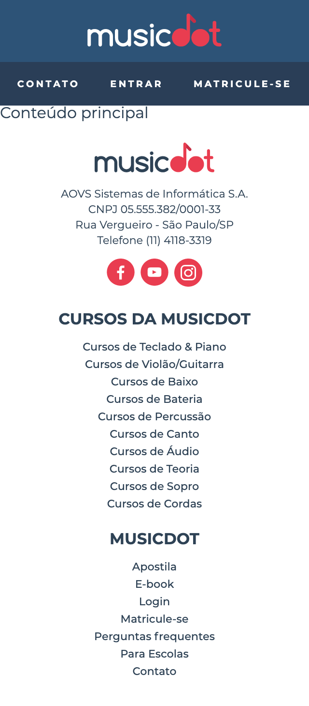
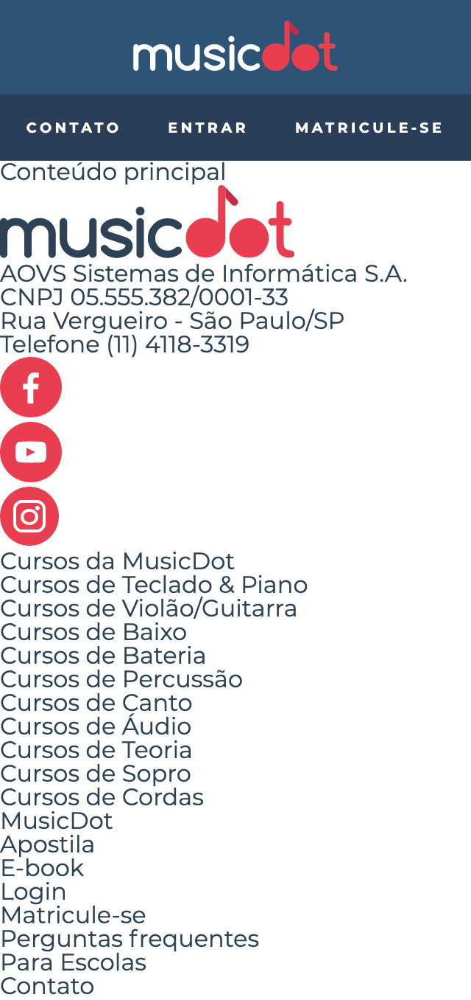

# Exercício: Desafio: crie o HTML do rodapé

## Objetivo
      
Agora iremos para o final da página e começaremos a construir o rodapé da página principal. No celular essa será aparência final dele:



Nesse momento não se preocupe com o estilo e escolha as tags mais semânticas que conseguir se lembrar para cada parte do conteúdo do rodapé, se tiver dúvidas sobre quais tags usar, sinta-se a vontade para discutir com colegas da turma ou perguntar para quem estiver te dando o curso.



## Passo a passo com código

1. No arquivo **`index.html`** na pasta **`raíz do projeto`** faça as seguintes alterações:

    ###### # index.html
    ```html
     <!doctype html>
     <html>
       <head>
         <meta charset="utf-8">
         <meta name="viewport" content="width=device-width">
         <title>Musicdot</title>
         <link rel="icon" href="img/favicon.ico">
         <link rel="stylesheet" href="https://fonts.googleapis.com/css?family=Montserrat:300,400,500,600,700,&display=block">
         <link rel="stylesheet" href="css/reset.css">
         <link rel="stylesheet" href="css/cabecalho.css">
       </head>
       <body>
     
         <header class="cabecalho">
           <a href="index.html">
             
           </a>
           
           <nav>
             <ul class="cabecalho__menu">
               <li class="cabecalho__item-menu"> <a href="sobre.html#contato"> Contato </a> </li>
               <li class="cabecalho__item-menu"> <a href="#"> Entrar </a> </li>
               <li class="cabecalho__item-menu cabecalho__item-menu--matricular"> <a href="#"> Matricule-se </a> </li>
             </ul>
           </nav>
         </header>
     
         <main>
           Conteúdo principal
         </main>
     
         <footer>
    -      R̶o̶d̶a̶p̶é̶
    +      <section>
    +        
    +
    +        <p>
    +          AOVS Sistemas de Informática S.A.
    +          <br>
    +          CNPJ 05.555.382/0001-33 
    +          <br>
    +          Rua Vergueiro - São Paulo/SP
    +          <br>
    +          Telefone (11) 4118-3319
    +        </p>
    +
    +        <ul>
    +          <li>
    +            <a href="https://www.facebook.com/musicdotonline">
    +              
    +            </a>
    +          </li>
    +          <li>
    +            <a href="https://www.youtube.com/user/musicdotonline">
    +              
    +            </a>
    +          </li>
    +          <li>
    +            <a href="https://www.instagram.com/musicdotonline/">
    +              
    +            </a>
    +          </li>
    +        </ul>
    +      </section>
    +
    +      <section>
    +        <h2> Cursos da MusicDot </h2>
    +        <nav>
    +          <ul>
    +            <li><a href="#">Cursos de Teclado & Piano</a></li>
    +            <li><a href="#">Cursos de Violão/Guitarra</a></li>
    +            <li><a href="#">Cursos de Baixo</a></li>
    +            <li><a href="#">Cursos de Bateria</a></li>
    +            <li><a href="#">Cursos de Percussão</a></li>
    +            <li><a href="#">Cursos de Canto</a></li>
    +            <li><a href="#">Cursos de Áudio</a></li>
    +            <li><a href="#">Cursos de Teoria</a></li>
    +            <li><a href="#">Cursos de Sopro</a></li>
    +            <li><a href="#">Cursos de Cordas</a></li>
    +          </ul>
    +        </nav>
    +      </section>
    +
    +      <section>
    +        <h2> MusicDot </h2>
    +        <nav>
    +          <ul>
    +            <li><a href="#">Apostila</a></li>
    +            <li><a href="#">E-book</a></li>
    +            <li><a href="#">Login</a></li>
    +            <li><a href="#">Matricule-se</a></li>
    +            <li><a href="#">Perguntas frequentes</a></li>
    +            <li><a href="#">Para Escolas</a></li>
    +            <li><a href="#">Contato</a></li>
    +          </ul>
    +        </nav>
    +      </section>
    +
         </footer>
       </body>
     </html>
    ```
