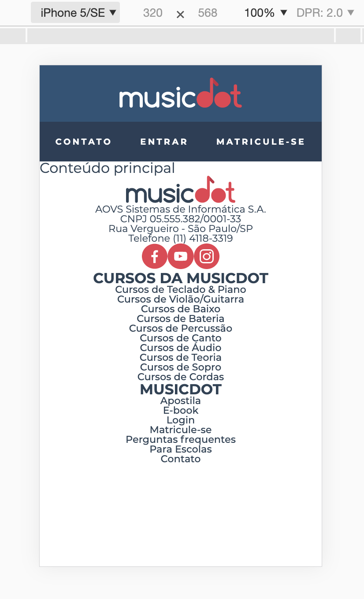

# Exercício: Conteúdo Rodapé

## Objetivo
      
Seguindo a risca a ideia do Progressive Enhancement, iniciaremos os estilos do rodapé pelo estilo do conteúdo de texto e imagens.

Replicaremos o seguinte estilo do rodapé:


## Passo a passo com código

1. Crie o arquivo **`rodape.css`** na pasta **`css`** com o seguinte código:

    ###### # css/rodape.css
    ```css
    +.rodape {
    +  text-align: center;
    +  font-size: 0.7rem;
    +}
    +
    +.rodape__logo {
    +  width: 11.25em;
    +}
    +
    +.rodape__lista-midias-sociais {
    +  display: flex;
    +  justify-content: center;
    +}
    +
    +.rodape__item-midias-sociais {
    +  width: 2.62em;
    +}
    +
    +.rodape__item-midias-sociais img {
    +  width: 100%;
    +}
    +
    +.rodape__titulo {
    +  font-size: 1.45em;
    +  font-weight: bold;
    +  text-transform: uppercase;
    +}
    +
    +.rodape_item-lista {  
    +  font-weight: 500;
    +}
    ```

2. No arquivo **`index.html`** na pasta **`raíz do projeto`** faça as seguintes alterações:

    ###### # index.html
    ```html
     <!doctype html>
     <html>
       <head>
         <meta charset="utf-8">
         <meta name="viewport" content="width=device-width">
         <title>Musicdot</title>
         <link rel="icon" href="img/favicon.ico">
         <link rel="stylesheet" href="https://fonts.googleapis.com/css?family=Montserrat:300,400,500,600,700,&display=block">
         <link rel="stylesheet" href="css/reset.css">
         <link rel="stylesheet" href="css/cabecalho.css">
    +    <link rel="stylesheet" href="css/rodape.css">
       </head>
       <body>
     
         <header class="cabecalho">
           <a href="index.html">
             
           </a>
           
           <nav>
             <ul class="cabecalho__menu">
               <li class="cabecalho__item-menu"> <a href="sobre.html#contato"> Contato </a> </li>
               <li class="cabecalho__item-menu"> <a href="#"> Entrar </a> </li>
               <li class="cabecalho__item-menu cabecalho__item-menu--matricular"> <a href="#"> Matricule-se </a> </li>
             </ul>
           </nav>
         </header>
     
         <main>
           Conteúdo principal
         </main>
     
    -    <̶f̶o̶o̶t̶e̶r̶>̶
    +    <footer class="rodape">
           <section>
    -        <̶i̶m̶g̶ s̶r̶c̶=̶"̶i̶m̶g̶/̶l̶o̶g̶o̶.̶s̶v̶g̶"̶ a̶l̶t̶=̶"̶L̶o̶g̶o̶ d̶a̶ M̶u̶s̶i̶c̶D̶o̶t̶"̶>̶
    +        
     
             <p>
               AOVS Sistemas de Informática S.A.
               <br>
               CNPJ 05.555.382/0001-33 
               <br>
               Rua Vergueiro - São Paulo/SP
               <br>
               Telefone (11) 4118-3319
             </p>
     
    -        <̶u̶l̶>̶
    -          <̶l̶i̶>̶
    +        <ul class="rodape__lista-midias-sociais">
    +          <li class="rodape__item-midias-sociais">
                 <a href="https://www.facebook.com/musicdotonline">
                   
                 </a>
               </li>
    -          <̶l̶i̶>̶
    +          <li class="rodape__item-midias-sociais">
                 <a href="https://www.youtube.com/user/musicdotonline">
                   
                 </a>
               </li>
    -          <̶l̶i̶>̶
    +          <li class="rodape__item-midias-sociais">
                 <a href="https://www.instagram.com/musicdotonline/">
                   
                 </a>
               </li>
             </ul>
           </section>
     
           <section>
    -        <̶h̶2̶>̶ C̶u̶r̶s̶o̶s̶ d̶a̶ M̶u̶s̶i̶c̶D̶o̶t̶ <̶/̶h̶2̶>̶
    +        <h2 class="rodape__titulo"> Cursos da MusicDot </h2>
             <nav>
               <ul>
    -            <̶l̶i̶>̶<̶a̶ h̶r̶e̶f̶=̶"̶#̶"̶>̶C̶u̶r̶s̶o̶s̶ d̶e̶ T̶e̶c̶l̶a̶d̶o̶ &̶ P̶i̶a̶n̶o̶<̶/̶a̶>̶<̶/̶l̶i̶>̶
    -            <̶l̶i̶>̶<̶a̶ h̶r̶e̶f̶=̶"̶#̶"̶>̶C̶u̶r̶s̶o̶s̶ d̶e̶ V̶i̶o̶l̶ã̶o̶/̶G̶u̶i̶t̶a̶r̶r̶a̶<̶/̶a̶>̶<̶/̶l̶i̶>̶
    -            <̶l̶i̶>̶<̶a̶ h̶r̶e̶f̶=̶"̶#̶"̶>̶C̶u̶r̶s̶o̶s̶ d̶e̶ B̶a̶i̶x̶o̶<̶/̶a̶>̶<̶/̶l̶i̶>̶
    -            <̶l̶i̶>̶<̶a̶ h̶r̶e̶f̶=̶"̶#̶"̶>̶C̶u̶r̶s̶o̶s̶ d̶e̶ B̶a̶t̶e̶r̶i̶a̶<̶/̶a̶>̶<̶/̶l̶i̶>̶
    -            <̶l̶i̶>̶<̶a̶ h̶r̶e̶f̶=̶"̶#̶"̶>̶C̶u̶r̶s̶o̶s̶ d̶e̶ P̶e̶r̶c̶u̶s̶s̶ã̶o̶<̶/̶a̶>̶<̶/̶l̶i̶>̶
    -            <̶l̶i̶>̶<̶a̶ h̶r̶e̶f̶=̶"̶#̶"̶>̶C̶u̶r̶s̶o̶s̶ d̶e̶ C̶a̶n̶t̶o̶<̶/̶a̶>̶<̶/̶l̶i̶>̶
    -            <̶l̶i̶>̶<̶a̶ h̶r̶e̶f̶=̶"̶#̶"̶>̶C̶u̶r̶s̶o̶s̶ d̶e̶ Á̶u̶d̶i̶o̶<̶/̶a̶>̶<̶/̶l̶i̶>̶
    -            <̶l̶i̶>̶<̶a̶ h̶r̶e̶f̶=̶"̶#̶"̶>̶C̶u̶r̶s̶o̶s̶ d̶e̶ T̶e̶o̶r̶i̶a̶<̶/̶a̶>̶<̶/̶l̶i̶>̶
    -            <̶l̶i̶>̶<̶a̶ h̶r̶e̶f̶=̶"̶#̶"̶>̶C̶u̶r̶s̶o̶s̶ d̶e̶ S̶o̶p̶r̶o̶<̶/̶a̶>̶<̶/̶l̶i̶>̶
    -            <̶l̶i̶>̶<̶a̶ h̶r̶e̶f̶=̶"̶#̶"̶>̶C̶u̶r̶s̶o̶s̶ d̶e̶ C̶o̶r̶d̶a̶s̶<̶/̶a̶>̶<̶/̶l̶i̶>̶
    +            <li class="rodape_item-lista"><a href="#">Cursos de Teclado & Piano</a></li>
    +            <li class="rodape_item-lista"><a href="#">Cursos de Violão/Guitarra</a></li>
    +            <li class="rodape_item-lista"><a href="#">Cursos de Baixo</a></li>
    +            <li class="rodape_item-lista"><a href="#">Cursos de Bateria</a></li>
    +            <li class="rodape_item-lista"><a href="#">Cursos de Percussão</a></li>
    +            <li class="rodape_item-lista"><a href="#">Cursos de Canto</a></li>
    +            <li class="rodape_item-lista"><a href="#">Cursos de Áudio</a></li>
    +            <li class="rodape_item-lista"><a href="#">Cursos de Teoria</a></li>
    +            <li class="rodape_item-lista"><a href="#">Cursos de Sopro</a></li>
    +            <li class="rodape_item-lista"><a href="#">Cursos de Cordas</a></li>
               </ul>
             </nav>
           </section>
     
           <section>
    -        <̶h̶2̶>̶ M̶u̶s̶i̶c̶D̶o̶t̶ <̶/̶h̶2̶>̶
    +        <h2 class="rodape__titulo"> MusicDot </h2>
             <nav>
               <ul>
    -            <̶l̶i̶>̶<̶a̶ h̶r̶e̶f̶=̶"̶#̶"̶>̶A̶p̶o̶s̶t̶i̶l̶a̶<̶/̶a̶>̶<̶/̶l̶i̶>̶
    -            <̶l̶i̶>̶<̶a̶ h̶r̶e̶f̶=̶"̶#̶"̶>̶E̶-̶b̶o̶o̶k̶<̶/̶a̶>̶<̶/̶l̶i̶>̶
    -            <̶l̶i̶>̶<̶a̶ h̶r̶e̶f̶=̶"̶#̶"̶>̶L̶o̶g̶i̶n̶<̶/̶a̶>̶<̶/̶l̶i̶>̶
    -            <̶l̶i̶>̶<̶a̶ h̶r̶e̶f̶=̶"̶#̶"̶>̶M̶a̶t̶r̶i̶c̶u̶l̶e̶-̶s̶e̶<̶/̶a̶>̶<̶/̶l̶i̶>̶
    -            <̶l̶i̶>̶<̶a̶ h̶r̶e̶f̶=̶"̶#̶"̶>̶P̶e̶r̶g̶u̶n̶t̶a̶s̶ f̶r̶e̶q̶u̶e̶n̶t̶e̶s̶<̶/̶a̶>̶<̶/̶l̶i̶>̶
    -            <̶l̶i̶>̶<̶a̶ h̶r̶e̶f̶=̶"̶#̶"̶>̶P̶a̶r̶a̶ E̶s̶c̶o̶l̶a̶s̶<̶/̶a̶>̶<̶/̶l̶i̶>̶
    -            <̶l̶i̶>̶<̶a̶ h̶r̶e̶f̶=̶"̶#̶"̶>̶C̶o̶n̶t̶a̶t̶o̶<̶/̶a̶>̶<̶/̶l̶i̶>̶
    +            <li class="rodape_item-lista"><a href="#">Apostila</a></li>
    +            <li class="rodape_item-lista"><a href="#">E-book</a></li>
    +            <li class="rodape_item-lista"><a href="#">Login</a></li>
    +            <li class="rodape_item-lista"><a href="#">Matricule-se</a></li>
    +            <li class="rodape_item-lista"><a href="#">Perguntas frequentes</a></li>
    +            <li class="rodape_item-lista"><a href="#">Para Escolas</a></li>
    +            <li class="rodape_item-lista"><a href="#">Contato</a></li>
               </ul>
             </nav>
           </section>
     
         </footer>
       </body>
     </html>
    ```
