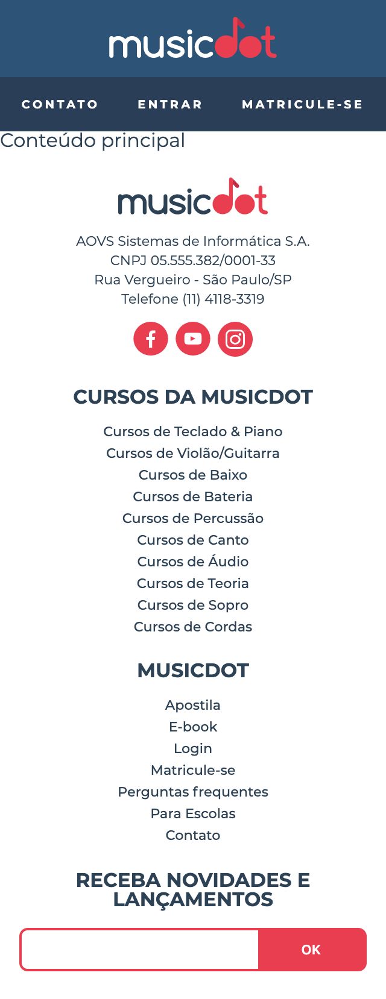

# Exercício: O formulário de newsletter do rodapé

## Objetivo
      
Agora, adicionaremos um formulário no final do conteúdo do rodapé:



Ess formulário terá apenas um campo de e-mail.

Lembre-se que por mais que não haja um rótulo/texto explicativo visível para o campo de email, ele deve estar presente no HTML por questões semânticas. O rótulo deve estar presente no HTML e deve ser removido apenas no estilo CSS.

## Passo a passo com código

1. Crie o arquivo **`form-newsletter.css`** na pasta **`css`** com o seguinte código:

    ###### # css/form-newsletter.css
    ```css
    +.form-newsletter {
    +  display: flex;
    +  width: 100%;
    +  overflow: hidden;
    +  box-sizing: border-box;
    +
    +  border-radius: 7px;
    +  border: 2px solid #e93d50;
    +  background-color: #e93d50;
    +}
    +
    +.form-newsletter__label {
    +  position:absolute;
    +  left:-10000px;
    +  width:1px;
    +  height:1px;
    +  overflow:hidden;
    +}
    +
    +.form-newsletter__campo {
    +  padding: .6rem .4rem;
    +  flex-grow: 1;
    +  border: none;
    +}
    +
    +.form-newsletter__botao {
    +  flex-grow: 1;
    +  border: none;
    +  
    +  text-transform: uppercase;
    +  font-weight: 600;
    +
    +  background-color: #e93d50;
    +  color: #fff;
    +}
    ```

2. No arquivo **`index.html`** na pasta **`raíz do projeto`** faça as seguintes alterações:

    ###### # index.html
    ```html
     <!doctype html>
     <html>
       <head>
         <meta charset="utf-8">
         <meta name="viewport" content="width=device-width">
         <title>Musicdot</title>
         <link rel="icon" href="img/favicon.ico">
         <link rel="stylesheet" href="https://fonts.googleapis.com/css?family=Montserrat:300,400,500,600,700,&display=block">
         <link rel="stylesheet" href="css/reset.css">
         <link rel="stylesheet" href="css/cabecalho.css">
         <link rel="stylesheet" href="css/rodape.css">
    +    <link rel="stylesheet" href="css/form-newsletter.css">
       </head>
       <body>
     
         <header class="cabecalho">
           <a href="index.html">
             
           </a>
           
           <nav>
             <ul class="cabecalho__menu">
               <li class="cabecalho__item-menu"> <a href="sobre.html#contato"> Contato </a> </li>
               <li class="cabecalho__item-menu"> <a href="#"> Entrar </a> </li>
               <li class="cabecalho__item-menu cabecalho__item-menu--matricular"> <a href="#"> Matricule-se </a> </li>
             </ul>
           </nav>
         </header>
     
         <main>
           Conteúdo principal
         </main>
     
         <footer class="rodape">
           <section class="rodape__secao">
             
     
             <p class="rodape__infos-empresa">
               AOVS Sistemas de Informática S.A.
               <br>
               CNPJ 05.555.382/0001-33 
               <br>
               Rua Vergueiro - São Paulo/SP
               <br>
               Telefone (11) 4118-3319
             </p>
     
             <ul class="rodape__lista-midias-sociais">
               <li class="rodape__item-midias-sociais">
                 <a href="https://www.facebook.com/musicdotonline">
                   
                 </a>
               </li>
               <li class="rodape__item-midias-sociais">
                 <a href="https://www.youtube.com/user/musicdotonline">
                   
                 </a>
               </li>
               <li class="rodape__item-midias-sociais">
                 <a href="https://www.instagram.com/musicdotonline/">
                   
                 </a>
               </li>
             </ul>
           </section>
     
           <section class="rodape__secao">
             <h2 class="rodape__titulo"> Cursos da MusicDot </h2>
             <nav>
               <ul>
                 <li class="rodape_item-lista"><a href="#">Cursos de Teclado & Piano</a></li>
                 <li class="rodape_item-lista"><a href="#">Cursos de Violão/Guitarra</a></li>
                 <li class="rodape_item-lista"><a href="#">Cursos de Baixo</a></li>
                 <li class="rodape_item-lista"><a href="#">Cursos de Bateria</a></li>
                 <li class="rodape_item-lista"><a href="#">Cursos de Percussão</a></li>
                 <li class="rodape_item-lista"><a href="#">Cursos de Canto</a></li>
                 <li class="rodape_item-lista"><a href="#">Cursos de Áudio</a></li>
                 <li class="rodape_item-lista"><a href="#">Cursos de Teoria</a></li>
                 <li class="rodape_item-lista"><a href="#">Cursos de Sopro</a></li>
                 <li class="rodape_item-lista"><a href="#">Cursos de Cordas</a></li>
               </ul>
             </nav>
           </section>
     
           <section class="rodape__secao">
             <h2 class="rodape__titulo"> MusicDot </h2>
             <nav>
               <ul>
                 <li class="rodape_item-lista"><a href="#">Apostila</a></li>
                 <li class="rodape_item-lista"><a href="#">E-book</a></li>
                 <li class="rodape_item-lista"><a href="#">Login</a></li>
                 <li class="rodape_item-lista"><a href="#">Matricule-se</a></li>
                 <li class="rodape_item-lista"><a href="#">Perguntas frequentes</a></li>
                 <li class="rodape_item-lista"><a href="#">Para Escolas</a></li>
                 <li class="rodape_item-lista"><a href="#">Contato</a></li>
               </ul>
             </nav>
           </section>
     
    +      <section class="rodape__secao">
    +        <h2 class="rodape__titulo"> 
    +          Receba novidades e lançamentos 
    +        </h2>
    +
    +        <form action="#" method="get" class="form-newsletter">
    +          <label for="form-newsletter__label" class="form-newsletter__label">
    +            Seu email pessoal
    +          </label>
    +          <input id="email-newsletter" name="email-newsletter" type="email" class="form-newsletter__campo">
    +          <button type="submit" class="form-newsletter__botao">
    +            OK
    +          </button>
    +        </form>
    +      </section>
         </footer>
       </body>
     </html>
    ```
