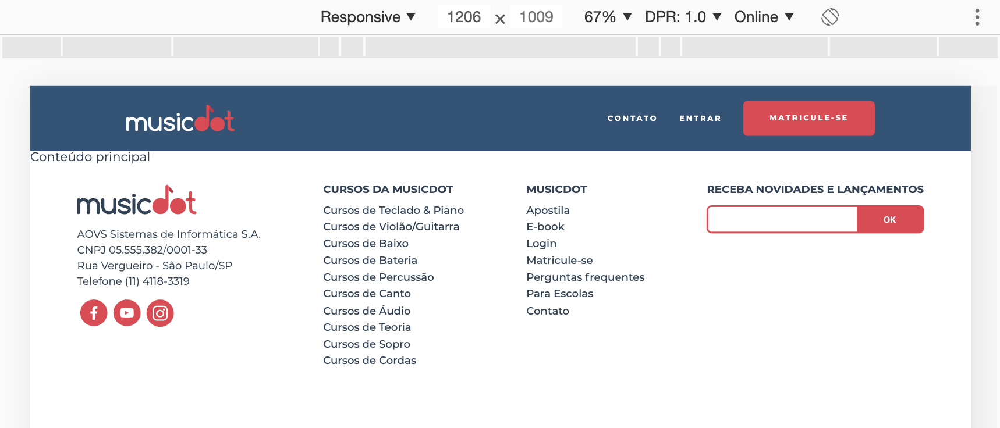

# Exercício: Rodapé em telas grandes sem sobrescrever tudo o que veio antes

## Objetivo
      
Agora inplementaremos o estilo do rodapé em telas maiores ainda, a partir de **`1200px`**:



Note que a disposição dos elementos difere bastante do estilo anterior. Só para sobrescrever esse estilo anterior precisaríamos escrever bastanta código. Para evitar isso, podemos limitar o estilo anterior para funcionar apenas em telas a partir de **`640px`** até telas de **`1200px`**.

## Passo a passo com código

1. No arquivo **`rodape.css`** na pasta **`css`** faça as seguintes alterações:

    ###### # css/rodape.css
    ```css
     .rodape {
       padding: 2em 5%;
     
       text-align: center;
       font-size: 0.7rem;
     }
     
     .rodape__logo {
       width: 11.25em;
       margin-bottom: 1em;
     }
     
     .rodape__lista-midias-sociais {
       display: flex;
       justify-content: center;
     }
     
     .rodape__infos-empresa {
       line-height: 1.5;
     }
     
     .rodape__lista-midias-sociais {
       display: flex;
       justify-content: center;
       margin-top: 1em;
     }
     
     .rodape__item-midias-sociais {
       width: 2.62em;
       margin: 0 .25em;
     }
     
     .rodape__item-midias-sociais img {
       width: 100%;
     }
     
     .rodape__titulo {
       margin-bottom: 1em;
     
       font-size: 1.45em;
       font-weight: bold;
       text-transform: uppercase;
     }
     
     .rodape_item-lista {  
       font-weight: 500;
       margin: 0.625em 0;
     }
     
     @media (max-width: 640px) {
       .rodape__secao + .rodape__secao {
         margin-top: 2em;
       }  
     }
     
    -@̶m̶e̶d̶i̶a̶(̶m̶i̶n̶-̶w̶i̶d̶t̶h̶:̶ 6̶4̶0̶p̶x̶)̶ {̶
    +@media(min-width: 640px) and (max-width: 1200px) {
       .rodape {
         display: flex;
         flex-wrap: wrap;
         justify-content: space-between;
     
         font-size: 1rem;
       }
     
       .rodape__secao--sobre,
       .rodape__secao--cursos,
       .rodape__secao--links,
       .rodape__secao--newsletter {
         width: 45%;
       }
     
       .rodape__secao--cursos {
         order: 1;
         margin: 0;
       }
     
       .rodape__secao--links {
         order: 2;
         margin: 0;
       }
     
       .rodape__secao--sobre {
         order: 3;
         margin-top: 2em;
       }
     
       .rodape__secao--newsletter {
         order: 4;
         margin-top: 2em;
       }
     }
    +
    +@media(min-width: 1200px) {
    +  .rodape {
    +    display: flex;
    +    justify-content: space-between;
    +    font-size: 0.85rem;
    +    
    +    text-align: left;
    +  }
    +
    +  .rodape__titulo {
    +    font-size: 1em;
    +  }
    +
    +  .rodape__lista-midias-sociais {
    +    justify-content: left;
    +  }
    +
    +  .rodape__secao {
    +    margin-top: 0;
    +  }
    +
    +  .rodape__secao + .rodape__secao {
    +    margin-left: 2em;
    +  }
    +}
    ```
