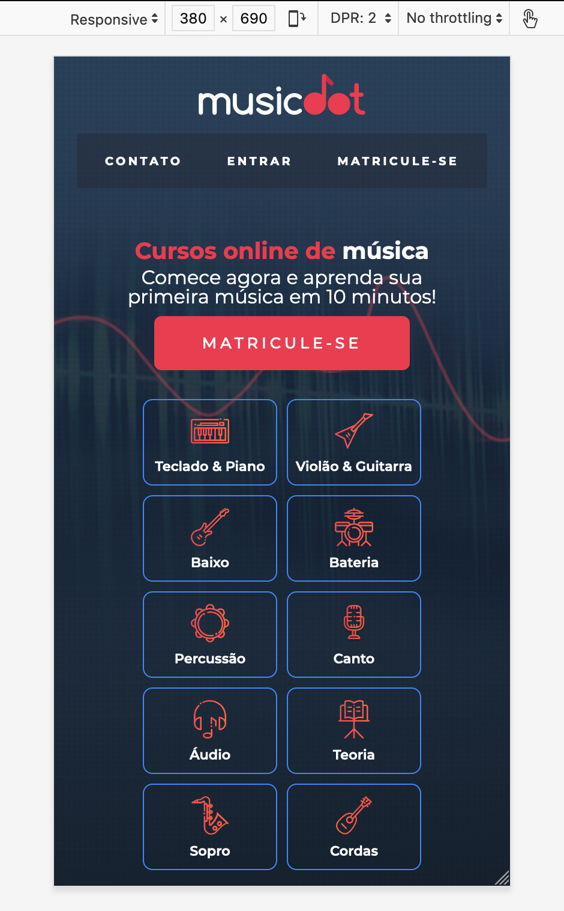
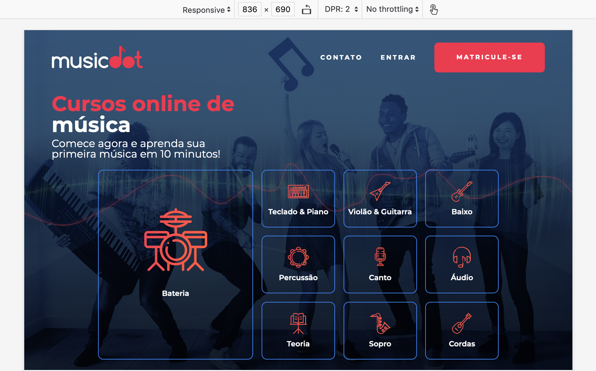
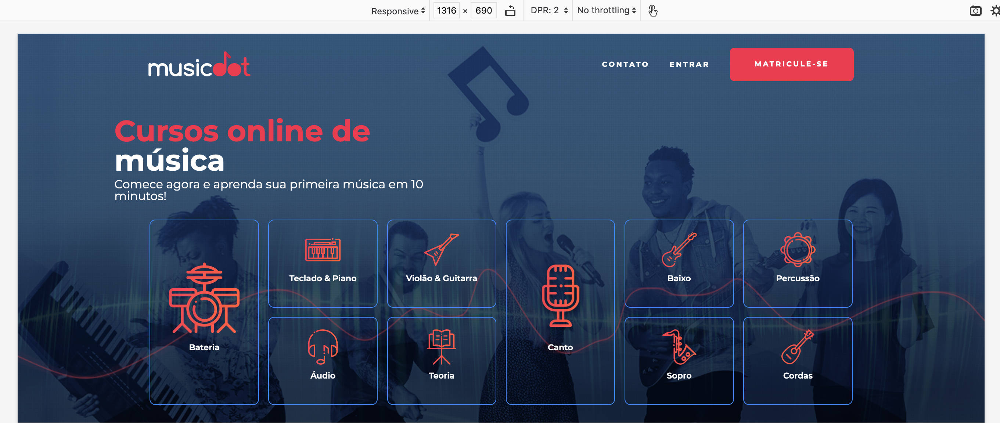

# Exercício: Conteúdo principal - a vitrine de cursos

## Objetivo
      






## Passo a passo com código

1. No arquivo **`cabecalho.css`** na pasta **`css`** faça as seguintes alterações:

    ###### # css/cabecalho.css
    ```css
     .cabecalho {
    +  position: absolute;
    +  top: 0;
    +  width: 100%;
    +  box-sizing: border-box;
    +
       text-align: center;
       font-size: 0.6rem;
       font-weight: bold;
       text-transform: uppercase;
       letter-spacing: 0.23em;
     
       color: #fff;
    -  b̶a̶c̶k̶g̶r̶o̶u̶n̶d̶-̶c̶o̶l̶o̶r̶:̶ #̶2̶D̶5̶3̶7̶7̶;̶
     }
     
     .cabecalho__logo {
       padding: 1.5em 0;
       width: 14.5em;
     }
     
     .cabecalho__menu {
       display: flex;
       justify-content: space-evenly;
       flex-wrap: wrap;
     
       background-color: #272B3A87;
     }
     
     .cabecalho__item-menu {
       display: inline-block;
     }
     
     .cabecalho__item-menu a {
       display: inline-block;
       padding: 1.86em 1.42em;
     }
     
     @media (min-width: 640px) {
       .cabecalho {
         padding-top: 0;
         padding-bottom: 0;
         display: flex;
         justify-content: space-between;
         align-items: center;
       }
     
       .cabecalho__logo {
         padding: 2.5em 0;
       }
     
       .cabecalho__menu {
         background-color: transparent; 
       }
     }
     
     @media (min-width: 770px) {
       .cabecalho__item-menu--matricular {
         margin-left: 1.42em;
     
         border-radius: 6px;
         background-color: #e93d50;
       }
     
       .cabecalho__item-menu--matricular a {
         padding: 1.8em 3.5em;
       }
     }
    ```

2. Crie o arquivo **`cursos.css`** na pasta **`css`** com o seguinte código:

    ###### # css/cursos.css
    ```css
    +.--largura-maxima {
    +    width: 100%;
    +  }
    +  
    +  .--largura-grande {
    +    width: 80%;
    +  }
    +  
    +  .botao {
    +    font-size: .8rem;
    +    font-weight: 500;
    +    letter-spacing: 2.9px;
    +    text-transform: uppercase;
    +    padding: 1rem 40px;
    +    margin-top: .5rem;
    +    margin-bottom: .5rem;
    +    border-radius: 6px;
    +    transition: .25s;
    +  }
    +  
    +  .botao:hover {
    +    transform: translate(0, .22rem);
    +    transition: .25s;
    +  }
    +
    +.cursos {
    +    color: #fff;
    +    text-align: center;
    +    background-image: url(../img/home-background-mobile.png);
    +    background-size: cover;
    +    padding-top: 9.5rem;
    +    display: flex;
    +    flex-direction: column;
    +    align-items: center;
    +  }
    +  
    +  .cursos__chamada {
    +    display: flex;
    +    flex-direction: column;
    +    align-items: center;
    +  }
    +  
    +  .chamada__titulo {
    +    color: #e93d50;
    +    font-weight: 700;
    +    font-size: 1.2rem;
    +    margin-bottom: .3rem;
    +  }
    +  
    +  .chamada__titulo--destaque {
    +    color: #fff;
    +  }
    +  
    +  .chamada p {
    +    font-weight: 500;
    +    line-height: 1.3;
    +    margin: 1rem 0;
    +  }
    +  
    +  .chamada__cursos__matricula {
    +    color: #fff;
    +    background-color: #e93d50;
    +  }
    +  
    +  .cursos__lista {
    +    font-size: .7rem;
    +    font-weight: 600;
    +    margin-top: 1rem;
    +    margin-bottom: 1rem;
    +    display: grid;
    +    grid-template-columns: 7rem 7rem;
    +    grid-template-rows: repeat(5, 4.5rem);
    +    grid-gap: .5rem;
    +    text-align: center;
    +  }
    +  
    +  .cursos__lista li {
    +    border: 1px solid #4286f4;
    +    border-radius: 8px;
    +    box-sizing: border-box;
    +    display: flex;
    +    justify-content: space-around;
    +    align-items: center;
    +    background-repeat: no-repeat;
    +    background-size: 2rem 2rem;
    +    background-position: top .6rem center;
    +    padding-top: 2.5rem;
    +    transition: .25s;
    +  }
    +  
    +  .cursos__lista li:hover {
    +    transform: translate(0, .22rem);
    +    background-color: rgba(66, 134, 244, 0.337);
    +    transition: .25s;
    +  }
    +  
    +  .curso--tecladopiano {
    +    background-image: url("../img/icone-teclado-piano.svg");
    +  }
    +  
    +  .curso--violaoguitarra {
    +    background-image: url("../img/icones-violao-guitarra.svg");
    +  }
    +  
    +  .curso--baixo {
    +    background-image: url("../img/icones-baixo.svg");
    +  }
    +  
    +  .curso--bateria {
    +    background-image: url("../img/icones-bateria.svg");
    +  }
    +  
    +  .curso--percussao {
    +    background-image: url("../img/icones-percussao.svg");
    +  }
    +  
    +  .curso--canto {
    +    background-image: url("../img/icones-canto.svg");
    +  }
    +  
    +  .curso--audio {
    +    background-image: url("../img/icones-audio.svg");
    +  }
    +  
    +  .curso--teoria {
    +    background-image: url("../img/icones-teoria.svg");
    +  }
    +  
    +  .curso--sopro {
    +    background-image: url("../img/icones-sopro.svg");
    +  }
    +  
    +  .curso--cordas {
    +    background-image: url("../img/icone-cordas.svg");
    +  }
    +  
    +  .cursos__lista img {
    +    width: 2rem;
    +    height: 2rem;
    +    margin-bottom: 5px;
    +  }
    +
    +  @media(min-width:768px) {
    +    .cursos {
    +        padding: 6rem 5% 0;
    +        background-image: url(../img/home-background.png);
    +      }
    +    
    +      .cursos__chamada {
    +        width: 300px;
    +        align-items: flex-start;
    +        align-self: flex-start;
    +        text-align: left;
    +      }
    +    
    +      .chamada__titulo {
    +        font-size: 2rem;
    +      }
    +    
    +      .chamada__cursos__matricula {
    +        display: none;
    +      }
    +    
    +      .cursos__lista {
    +        grid-template-columns: repeat(5, 7rem);
    +        grid-template-rows: 5.5rem 5.5rem 5.5rem;
    +        gap: .8rem;
    +      }
    +    
    +      .cursos__lista li {
    +        background-repeat: no-repeat;
    +        background-size: 2rem 2rem;
    +        background-position: top 1rem center;
    +        padding-top: 2.5rem;
    +      }
    +    
    +    .cursos__lista .curso--destaque {
    +        order: -1;
    +        grid-area: 1/1/span 3/3;
    +        padding-top: 5.5rem;
    +        background-size: 6rem 6rem;
    +        background-position: top 3.6rem center;
    +    }
    +}
    +
    +@media(min-width:1200px) {
    +    .cursos {
    +        padding: 7rem 10% 0;
    +      }
    +    
    +      .cursos__chamada {
    +        width: 450px;
    +      }
    +    
    +      .chamada__titulo {
    +        font-size: 2.5rem;
    +      }
    +    
    +      .cursos__lista {
    +        grid-template-columns: repeat(6, 9.3rem);
    +        grid-template-rows: 7.5rem 7.5rem;
    +        margin-top: 1.5rem;
    +        margin-bottom: 1.5rem;
    +      }
    +    
    +      .cursos__lista li {
    +        background-repeat: no-repeat;
    +        background-size: 3rem 3rem;
    +        background-position: top 1rem center;
    +        padding-top: 2.5rem;
    +      }
    +    
    +      .cursos__lista .curso--destaque {
    +        order: -1;
    +        grid-area: 1/1/span 2/2;
    +        padding-top: 6rem;
    +        background-size: 6rem 6rem;
    +        background-position: top 3.6rem center;
    +      }
    +    
    +      .cursos__lista .curso--destaque2 {
    +        order: -1;
    +        grid-area: 1/4/span 2/5;
    +        padding-top: 6rem;
    +        background-size: 6rem 6rem;
    +        background-position: top 3.6rem center;
    +      }
    +    
    +      .cursos__lista p {
    +        font-size: .9rem;
    +      }
    +    
    +    
    +      .curso--destaque2 .imagem-destaque2 {
    +        width: 6rem;
    +        height: 6rem;
    +        margin-bottom: .8rem;
    +      }
    +}
    +
    +@media(min-width:1440px) {
    +    .cursos__lista {
    +      grid-template-columns: repeat(6, 11rem);
    +    }
    +}
    +
    +@media(min-width:1600px) {
    +    .cursos__lista {
    +        grid-template-columns: repeat(6, 13rem);
    +      }
    +    
    +      .cursos__lista img {
    +        width: 3rem;
    +        height: 3rem;
    +        margin-bottom: 10px;
    +      }
    +}
    ```

3. No arquivo **`index.html`** na pasta **`raíz do projeto`** faça as seguintes alterações:

    ###### # index.html
    ```html
     <!doctype html>
     <html>
       <head>
         <meta charset="utf-8">
         <meta name="viewport" content="width=device-width">
         <title>Musicdot</title>
         <link rel="icon" href="img/favicon.ico">
         <link rel="stylesheet" href="https://fonts.googleapis.com/css?family=Montserrat:300,400,500,600,700,&display=block">
         <link rel="stylesheet" href="css/reset.css">
         <link rel="stylesheet" href="css/container.css">
         <link rel="stylesheet" href="css/cabecalho.css">
    +    <link rel="stylesheet" href="css/cursos.css">
         <link rel="stylesheet" href="css/rodape.css">
         <link rel="stylesheet" href="css/form-newsletter.css">
       </head>
       <body>
     
         <header class="cabecalho container">
           <a href="index.html">
             
           </a>
           
           <nav>
             <ul class="cabecalho__menu">
               <li class="cabecalho__item-menu"> <a href="sobre.html#contato"> Contato </a> </li>
               <li class="cabecalho__item-menu"> <a href="#"> Entrar </a> </li>
               <li class="cabecalho__item-menu cabecalho__item-menu--matricular"> <a href="#"> Matricule-se </a> </li>
             </ul>
           </nav>
         </header>
     
         <main>
    -      C̶o̶n̶t̶e̶ú̶d̶o̶ p̶r̶i̶n̶c̶i̶p̶a̶l̶
    +      <section class="cursos">
    +        <article class="cursos__chamada --largura-grande">
    +          <h1 class="chamada__titulo">Cursos online de <strong class="chamada__titulo--destaque">música</strong></h1>
    +          <p>Comece agora e aprenda sua primeira música em 10 minutos!</p>
    +          <a href="cursos.html" class="chamada__cursos__matricula botao">Matricule-se</a>
    +        </article>
    +        <nav>
    +            <ul class="cursos__lista">
    +                <li class="curso--tecladopiano">
    +                    <a href="#">Teclado & Piano</a>
    +                </li>
    +                <li class="curso--violaoguitarra">
    +                    <a href="#">Violão & Guitarra</a>
    +                </li>
    +                <li class="curso--baixo">
    +                    <a href="#">Baixo</a>
    +                </li>
    +                <li class="curso--bateria curso--destaque">
    +                    <a href="#">Bateria</a>
    +                </li>
    +                <li class="curso--percussao">
    +                    <a href="#">Percussão</a>
    +                </li>
    +                <li class="curso--canto curso--destaque2">
    +                    <a href="#">Canto</a>
    +                </li>
    +                <li class="curso--audio">
    +                    <a href="#">Áudio</a>
    +                </li>
    +                <li class="curso--teoria">
    +                    <a href="#">Teoria</a>
    +                </li>
    +                <li class="curso--sopro">
    +                    <a href="#">Sopro</a>
    +                </li>
    +                <li class="curso--cordas">
    +                    <a href="#">Cordas</a>
    +                </li>
    +            </ul>
    +        </nav>
    +      </section>
         </main>
     
         <footer class="rodape container">
           <section class="rodape__secao rodape__secao--sobre">
             
     
             <p class="rodape__infos-empresa">
               AOVS Sistemas de Informática S.A.
               <br>
               CNPJ 05.555.382/0001-33 
               <br>
               Rua Vergueiro - São Paulo/SP
               <br>
               Telefone (11) 4118-3319
             </p>
     
             <ul class="rodape__lista-midias-sociais">
               <li class="rodape__item-midias-sociais">
                 <a href="https://www.facebook.com/musicdotonline">
                   
                 </a>
               </li>
               <li class="rodape__item-midias-sociais">
                 <a href="https://www.youtube.com/user/musicdotonline">
                   
                 </a>
               </li>
               <li class="rodape__item-midias-sociais">
                 <a href="https://www.instagram.com/musicdotonline/">
                   
                 </a>
               </li>
             </ul>
           </section>
     
           <section class="rodape__secao rodape__secao--cursos">
             <h2 class="rodape__titulo"> Cursos da MusicDot </h2>
             <nav>
               <ul>
                 <li class="rodape_item-lista"><a href="#">Cursos de Teclado & Piano</a></li>
                 <li class="rodape_item-lista"><a href="#">Cursos de Violão/Guitarra</a></li>
                 <li class="rodape_item-lista"><a href="#">Cursos de Baixo</a></li>
                 <li class="rodape_item-lista"><a href="#">Cursos de Bateria</a></li>
                 <li class="rodape_item-lista"><a href="#">Cursos de Percussão</a></li>
                 <li class="rodape_item-lista"><a href="#">Cursos de Canto</a></li>
                 <li class="rodape_item-lista"><a href="#">Cursos de Áudio</a></li>
                 <li class="rodape_item-lista"><a href="#">Cursos de Teoria</a></li>
                 <li class="rodape_item-lista"><a href="#">Cursos de Sopro</a></li>
                 <li class="rodape_item-lista"><a href="#">Cursos de Cordas</a></li>
               </ul>
             </nav>
           </section>
     
           <section class="rodape__secao rodape__secao--links">
             <h2 class="rodape__titulo"> MusicDot </h2>
             <nav>
               <ul>
                 <li class="rodape_item-lista"><a href="#">Apostila</a></li>
                 <li class="rodape_item-lista"><a href="#">E-book</a></li>
                 <li class="rodape_item-lista"><a href="#">Login</a></li>
                 <li class="rodape_item-lista"><a href="#">Matricule-se</a></li>
                 <li class="rodape_item-lista"><a href="#">Perguntas frequentes</a></li>
                 <li class="rodape_item-lista"><a href="#">Para Escolas</a></li>
                 <li class="rodape_item-lista"><a href="#">Contato</a></li>
               </ul>
             </nav>
           </section>
     
           <section class="rodape__secao rodape__secao--newsletter">
             <h2 class="rodape__titulo"> 
               Receba novidades e lançamentos 
             </h2>
     
             <form action="#" method="get" class="form-newsletter">
               <label for="form-newsletter__label" class="form-newsletter__label">
                 Seu email pessoal
               </label>
               <input id="email-newsletter" name="email-newsletter" type="email" class="form-newsletter__campo">
               <button type="submit" class="form-newsletter__botao">
                 OK
               </button>
             </form>
           </section>
         </footer>
       </body>
     </html>
    ```
