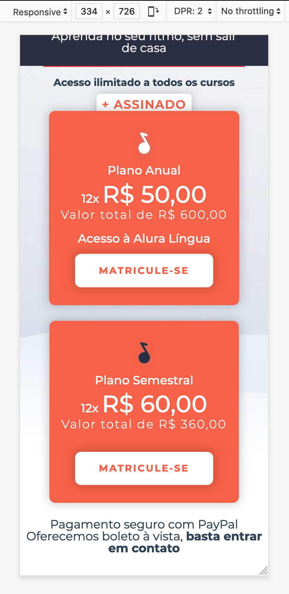
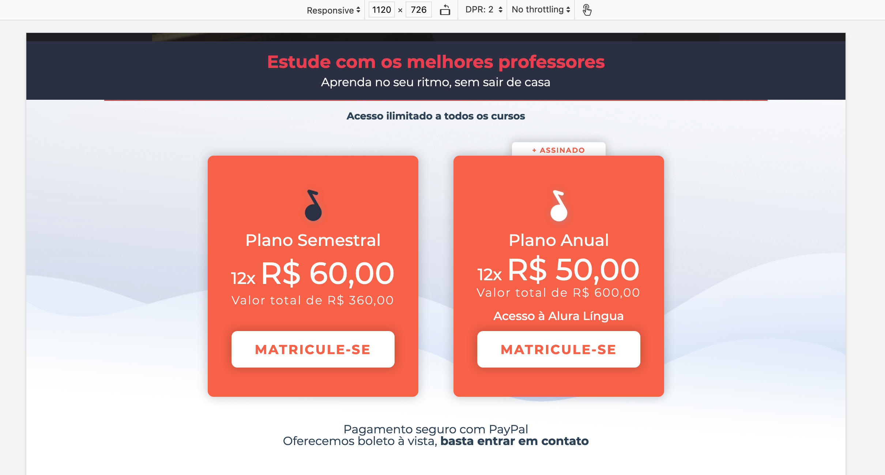

# Exercício: Conteúdo principal (opcional) - os planos

## Objetivo
      




## Passo a passo com código

1. Crie o arquivo **`planos.css`** na pasta **`css`** com o seguinte código:

    ###### # css/planos.css
    ```css
    +.planos {
    +    background-image: url(../img/planos-background-mobile.png);
    +    background-size: cover;
    +    background-repeat: no-repeat;
    +    text-align: center;
    +    padding-top: 15px;
    +    padding-bottom: 1.8rem;
    +    display: grid;
    +    justify-items: center;
    +    position: relative;
    +}
    +
    +.planos::before {
    +    content: "";
    +    width: 81%;
    +    height: .1rem;
    +    background-color: #e93d50;
    +    position: absolute;
    +    top: 0;
    +    left: 50%;
    +    transform: translate(-50%, 0);
    +}
    +
    +.planos__titulo {
    +    font-size: .85rem;
    +    font-weight: 700;
    +    margin-bottom: 2rem;
    +}
    +
    +.planos__card {
    +    background-color: #f76148;
    +    border-radius: 8px;
    +    margin-bottom: 1.3rem;
    +    color: #fff;
    +    padding: 4rem 1rem 1rem;
    +    display: flex;
    +    flex-direction: column;
    +    align-items: center;
    +    box-shadow: 0 0 .8rem .1rem rgba(0, 0, 0, .2);
    +    background-repeat: no-repeat;
    +    background-size: 1.7rem;
    +    background-position: top 1.5rem center;
    +}
    +
    +.card--anual {
    +    background-image: url(../img/simbolo-musidot-branco.svg);
    +}
    +
    +.card--semestral {
    +    background-image: url(../img/simbolo-musidot-dark.svg);
    +}
    +
    +.plano__titulo {
    +    margin: 8px 0;
    +}
    +
    +.planos__card p + p {
    +    font-weight: 300;
    +    margin-top: .2rem;
    +    letter-spacing: 1.5px;
    +}
    +
    +.plano__titulo, .plano__titulo + p {
    +    font-size: 1rem;
    +    font-weight: 500;
    +}
    +
    +.valor--destaque {
    +    font-size: 2rem;
    +    font-weight: 700;
    +}
    +
    +.planos__card span {
    +    font-weight: 500;
    +}
    +
    +.cards__botao {
    +    color: #f76148;
    +    text-transform: uppercase;
    +    letter-spacing: 1.8px;
    +    font-weight: 600;
    +    border-radius: 8px;
    +    margin-top: .8rem;
    +    padding: 1rem 2rem;
    +    background-color: #fff;
    +    box-shadow: 0 0 .8rem .1rem rgba(0, 0, 0, .2);
    +}
    +
    +.card--anual {
    +    position: relative;
    +    z-index: 2;
    +}
    +
    +.plano--destaque {
    +    color: #f76148;
    +    font-weight: 600;
    +    text-transform: uppercase;
    +    letter-spacing: 1.1px;
    +    width: 8rem;
    +    padding: .4rem 0 .8rem;
    +    border-radius: 5px;
    +    box-shadow: 0 0 .8rem .05rem rgba(0, 0, 0, .2);
    +    background-color: #fff;
    +    position: absolute;
    +    transform: translate(-50%, -65%);
    +    z-index: 1;
    +}
    +
    +.card--anual p + p, .card--semestral p + p {
    +    margin-bottom: 1rem;
    +}
    +
    +.planos > p {
    +    width: 250px;
    +    font-size: .6rem;
    +    font-weight: 600;
    +    line-height: 18px;
    +}
    +
    +.planos a {
    +    font-weight: 700;
    +}
    +
    +
    +@media(min-width:768px) {
    +    .planos {
    +        grid-template-columns: 20rem 20rem;
    +        grid-template-areas:
    +        "header header"
    +        "card1 card2" 
    +        "footer footer";
    +        gap: 1rem;
    +        justify-content: center;
    +        padding-bottom: 2rem;
    +        background-image: url(../img/planos-background.png);
    +        background-size: cover;
    +    }
    +    
    +    .planos__titulo {
    +        grid-area: header;
    +    }
    +    
    +    .cards__planoanual {
    +        grid-area: card2;
    +    }
    +    
    +    .card--semestral {
    +        grid-area: card1;
    +    }
    +    
    +    .planos__pagamentos {
    +        grid-column-end: span 2;
    +    }
    +    
    +    .planos--maisassinado {
    +        font-size: .8rem;
    +    }
    +    
    +    .planos__card {
    +        padding: 6rem 2rem 2rem;
    +        justify-content: space-between;
    +        background-size: 2.5rem;
    +        background-position: top 2.5rem center;
    +    }
    +    
    +    .planos__card img {
    +        width: 2.5rem;
    +    }
    +    
    +    .plano__titulo, .plano__titulo + p {
    +        font-size: 1.4rem;
    +        font-weight: 500;
    +    }
    +    
    +    .valor--destaque {
    +        font-size: 2.6rem;
    +        font-weight: 700;
    +    }
    +    
    +    .plano--destaque {
    +        font-size: .6rem;
    +    }
    +    
    +    .cards__botao {
    +        font-size: 1.1rem;
    +        transition: .25s;
    +    }
    +    
    +    .planos > p {
    +        font-size: .9rem;
    +        font-weight: 600;
    +        line-height: 18px;
    +    }
    +}
    +
    +@media(min-width:1200px) {
    +    .planos__titulo {
    +        font-size: 1.2rem;
    +    }
    +    
    +    .plano--destaque {
    +        font-size: .9rem;
    +        width: 10rem;
    +        transform: translate(-50%, -75%);
    +    }
    +    
    +}
    ```

2. No arquivo **`index.html`** na pasta **`raíz do projeto`** faça as seguintes alterações:

    ###### # index.html
    ```html
     <!doctype html>
     <html>
       <head>
         <meta charset="utf-8">
         <meta name="viewport" content="width=device-width">
         <title>Musicdot</title>
         <link rel="icon" href="img/favicon.ico">
         <link rel="stylesheet" href="https://fonts.googleapis.com/css?family=Montserrat:300,400,500,600,700,&display=block">
         <link rel="stylesheet" href="css/reset.css">
         <link rel="stylesheet" href="css/container.css">
         <link rel="stylesheet" href="css/cabecalho.css">
         <link rel="stylesheet" href="css/cursos.css">
         <link rel="stylesheet" href="css/video.css">
    +    <link rel="stylesheet" href="css/planos.css">
         <link rel="stylesheet" href="css/rodape.css">
         <link rel="stylesheet" href="css/form-newsletter.css">
       </head>
       <body>
     
         <header class="cabecalho container">
           <a href="index.html">
             
           </a>
           
           <nav>
             <ul class="cabecalho__menu">
               <li class="cabecalho__item-menu"> <a href="sobre.html#contato"> Contato </a> </li>
               <li class="cabecalho__item-menu"> <a href="#"> Entrar </a> </li>
               <li class="cabecalho__item-menu cabecalho__item-menu--matricular"> <a href="#"> Matricule-se </a> </li>
             </ul>
           </nav>
         </header>
     
         <main>
           <section class="cursos">
             <article class="cursos__chamada --largura-grande">
               <h1 class="chamada__titulo">Cursos online de <strong class="chamada__titulo--destaque">música</strong></h1>
               <p>Comece agora e aprenda sua primeira música em 10 minutos!</p>
               <a href="cursos.html" class="chamada__cursos__matricula botao">Matricule-se</a>
             </article>
             <nav>
                 <ul class="cursos__lista">
                     <li class="curso--tecladopiano">
                         <a href="#">Teclado & Piano</a>
                     </li>
                     <li class="curso--violaoguitarra">
                         <a href="#">Violão & Guitarra</a>
                     </li>
                     <li class="curso--baixo">
                         <a href="#">Baixo</a>
                     </li>
                     <li class="curso--bateria curso--destaque">
                         <a href="#">Bateria</a>
                     </li>
                     <li class="curso--percussao">
                         <a href="#">Percussão</a>
                     </li>
                     <li class="curso--canto curso--destaque2">
                         <a href="#">Canto</a>
                     </li>
                     <li class="curso--audio">
                         <a href="#">Áudio</a>
                     </li>
                     <li class="curso--teoria">
                         <a href="#">Teoria</a>
                     </li>
                     <li class="curso--sopro">
                         <a href="#">Sopro</a>
                     </li>
                     <li class="curso--cordas">
                         <a href="#">Cordas</a>
                     </li>
                 </ul>
             </nav>
           </section>
           <section class="video">
             <video  controls class="video--mobile" src="video/video-promocional.mp4" poster="img/video-principal-mobile.png"></video>
             <video controls class="video--desktop" src="video/video-promocional.mp4" poster="img/video-principal.png"></video>
             <article class="video__textos">
               <h2 class="textos__titulo">Estude com os melhores professores</h2>
               <p>Aprenda no seu ritmo, sem sair de casa</p>
             </article>
           </section>
    +      <section class="planos"> 
    +        <h2 class="planos__titulo">Acesso ilimitado a todos os cursos</h2>
    +        <article class="cards__planoanual">
    +          <span class="plano--destaque"> + Assinado</span>
    +          <div class="planos__card card--anual">
    +            <h3 class="plano__titulo">Plano Anual</h3>
    +            <p>12x <span class="valor--destaque">R$ 50,00</span></p>
    +            <p>Valor total de R$ 600,00</p>
    +            <span>Acesso à Alura Língua</span>
    +            <a href="cursos.html" class="cards__botao botao">Matricule-se</a>
    +          </div>
    +        </article>
    +        <article class="planos__card card--semestral">
    +          <h3 class="plano__titulo">Plano Semestral</h3>
    +          <p>12x <span class="valor--destaque">R$ 60,00</span></p>
    +          <p>Valor total de R$ 360,00</p>
    +          <a href="cursos.html" class="cards__botao botao">Matricule-se</a>
    +        </article>
    +        <article class="planos__pagamentos">
    +          <p>Pagamento seguro com PayPal</p>
    +          <p>Oferecemos boleto à vista, <a href="#">basta entrar em contato</a></p>
    +        </article>
    +      </section>
         </main>
     
         <footer class="rodape container">
           <section class="rodape__secao rodape__secao--sobre">
             
     
             <p class="rodape__infos-empresa">
               AOVS Sistemas de Informática S.A.
               <br>
               CNPJ 05.555.382/0001-33 
               <br>
               Rua Vergueiro - São Paulo/SP
               <br>
               Telefone (11) 4118-3319
             </p>
     
             <ul class="rodape__lista-midias-sociais">
               <li class="rodape__item-midias-sociais">
                 <a href="https://www.facebook.com/musicdotonline">
                   
                 </a>
               </li>
               <li class="rodape__item-midias-sociais">
                 <a href="https://www.youtube.com/user/musicdotonline">
                   
                 </a>
               </li>
               <li class="rodape__item-midias-sociais">
                 <a href="https://www.instagram.com/musicdotonline/">
                   
                 </a>
               </li>
             </ul>
           </section>
     
           <section class="rodape__secao rodape__secao--cursos">
             <h2 class="rodape__titulo"> Cursos da MusicDot </h2>
             <nav>
               <ul>
                 <li class="rodape_item-lista"><a href="#">Cursos de Teclado & Piano</a></li>
                 <li class="rodape_item-lista"><a href="#">Cursos de Violão/Guitarra</a></li>
                 <li class="rodape_item-lista"><a href="#">Cursos de Baixo</a></li>
                 <li class="rodape_item-lista"><a href="#">Cursos de Bateria</a></li>
                 <li class="rodape_item-lista"><a href="#">Cursos de Percussão</a></li>
                 <li class="rodape_item-lista"><a href="#">Cursos de Canto</a></li>
                 <li class="rodape_item-lista"><a href="#">Cursos de Áudio</a></li>
                 <li class="rodape_item-lista"><a href="#">Cursos de Teoria</a></li>
                 <li class="rodape_item-lista"><a href="#">Cursos de Sopro</a></li>
                 <li class="rodape_item-lista"><a href="#">Cursos de Cordas</a></li>
               </ul>
             </nav>
           </section>
     
           <section class="rodape__secao rodape__secao--links">
             <h2 class="rodape__titulo"> MusicDot </h2>
             <nav>
               <ul>
                 <li class="rodape_item-lista"><a href="#">Apostila</a></li>
                 <li class="rodape_item-lista"><a href="#">E-book</a></li>
                 <li class="rodape_item-lista"><a href="#">Login</a></li>
                 <li class="rodape_item-lista"><a href="#">Matricule-se</a></li>
                 <li class="rodape_item-lista"><a href="#">Perguntas frequentes</a></li>
                 <li class="rodape_item-lista"><a href="#">Para Escolas</a></li>
                 <li class="rodape_item-lista"><a href="#">Contato</a></li>
               </ul>
             </nav>
           </section>
     
           <section class="rodape__secao rodape__secao--newsletter">
             <h2 class="rodape__titulo"> 
               Receba novidades e lançamentos 
             </h2>
     
             <form action="#" method="get" class="form-newsletter">
               <label for="form-newsletter__label" class="form-newsletter__label">
                 Seu email pessoal
               </label>
               <input id="email-newsletter" name="email-newsletter" type="email" class="form-newsletter__campo">
               <button type="submit" class="form-newsletter__botao">
                 OK
               </button>
             </form>
           </section>
         </footer>
       </body>
     </html>
    ```
