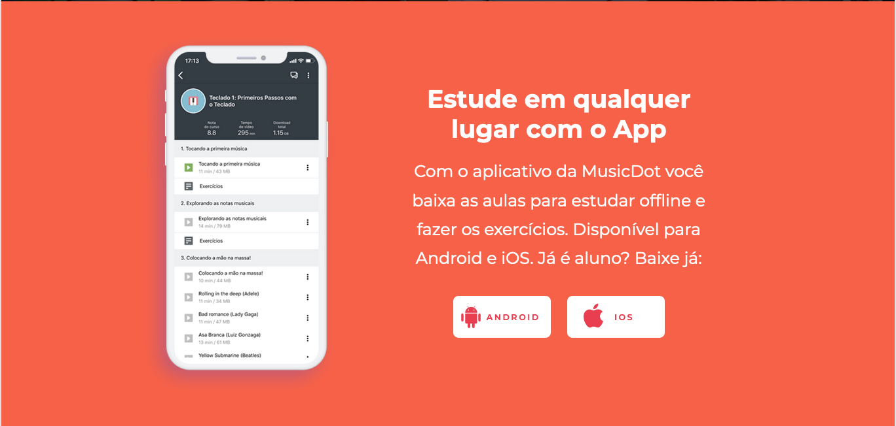

# Exercício: Conteúdo Principal - chamada dos aplicativos

## Objetivo
      




## Passo a passo com código

1. Crie o arquivo **`chamada-app.css`** na pasta **`css`** com o seguinte código:

    ###### # css/chamada-app.css
    ```css
    +.chamada__aplicativo {
    +    color: #fff;
    +    text-align: center;
    +    background-color: #f76148;
    +    padding: 2rem 7.5%;
    +    display: grid;
    +    grid-template-columns: 1fr 1fr;
    +    grid-template-rows: auto;
    +    justify-items: center;
    +}
    +
    +.aplicativo__titulo {
    +    font-size: 1.2rem;
    +    font-weight: 700;
    +    margin-bottom: .8rem;
    +    line-height: 24px;
    +    grid-column-end: span 2;
    +}
    +
    +.aplicativo__texto {
    +    line-height: 20px;
    +    margin-bottom: 15px;
    +    grid-column-end: span 2; 
    +}
    +
    +.texto__destaque {
    +    font-weight: 600;
    +}
    +
    +.chamada__aplicativo__button--wrapper {
    +    display: flex;
    +    justify-content: space-evenly;
    +}
    +
    +.aplicativo__button {
    +    color: #e93d50;
    +    font-weight: 600;
    +    letter-spacing: 1.6px;
    +    text-transform: uppercase;
    +    background-color: #fff;
    +    border: none;
    +    border-radius: 5px;
    +    width: 5.9rem;
    +    padding: 1rem 0 1rem 1rem;
    +    box-sizing: border-box;
    +    font-size: .5rem;
    +    background-size: 1.2rem;
    +    background-repeat: no-repeat;
    +}
    +
    +.app__download--android {
    +    background-image: url(../img/icone-android-logo.svg);
    +    background-position: left .5rem center;
    +    padding-left: 1.4rem;
    +}
    +
    +.app__download--ios {
    +    background-image: url(../img/icone-apple-logo.svg);
    +    background-position: left 1rem top .4rem;
    +}
    +
    +.aplicativo--icone {
    +    width: 1.2rem;
    +    height: 1.2rem;
    +    margin-right: .2rem;
    +    vertical-align: middle;
    +}
    +
    +@media(min-width:768px) {
    +    .chamada__aplicativo {
    +        background-image: url(../img/mockup-app.png);
    +        background-size: 12rem;
    +        background-position: left 20% center;
    +        background-repeat: no-repeat;
    +        padding: 5rem 20%;
    +        grid-template-columns: 1fr 9rem 9rem;
    +        column-gap: 1rem;
    +        grid-template-areas: 
    +        ". titulo titulo"
    +        ". texto texto"
    +        ". android ios";
    +    }
    +    
    +    .aplicativo__titulo {
    +        font-size: 1.5rem;
    +        line-height: 29px;
    +        grid-area: titulo;
    +    }
    +    
    +    .aplicativo__texto {
    +        line-height: 28px;
    +        grid-area: texto;
    +    }
    +    
    +    .app__download--android {
    +        grid-area: android;
    +        justify-self: flex-end;
    +    }
    +    
    +    .app__download--ios {
    +        grid-area: ios;
    +        justify-self: flex-start;
    +    }
    +}
    +
    +@media(min-width:1200px) {
    +    .chamada__aplicativo {
    +        grid-template-columns: 1fr 12rem 12rem;
    +    }
    +    
    +    .aplicativo__titulo {
    +        font-size: 1.8rem;
    +    }
    +    
    +    .aplicativo__button {
    +        width: 9.5rem;
    +        font-size: .8rem;
    +        background-size: 1.8rem;
    +        padding: 1.5rem 0 1.5rem 1rem;
    +    }
    +    
    +    .app__download--android {
    +        background-position: left .7rem top .8rem;
    +        padding-left: 1.4rem;
    +    }
    +    
    +    .app__download--ios {
    +        background-position: left 1.3rem top .6rem;
    +    }
    +}
    ```

2. No arquivo **`index.html`** na pasta **`raíz do projeto`** faça as seguintes alterações:

    ###### # index.html
    ```html
     <!doctype html>
     <html>
       <head>
         <meta charset="utf-8">
         <meta name="viewport" content="width=device-width">
         <title>Musicdot</title>
         <link rel="icon" href="img/favicon.ico">
         <link rel="stylesheet" href="https://fonts.googleapis.com/css?family=Montserrat:300,400,500,600,700,&display=block">
         <link rel="stylesheet" href="css/reset.css">
         <link rel="stylesheet" href="css/container.css">
         <link rel="stylesheet" href="css/cabecalho.css">
         <link rel="stylesheet" href="css/cursos.css">
         <link rel="stylesheet" href="css/video.css">
         <link rel="stylesheet" href="css/planos.css">
         <link rel="stylesheet" href="css/beneficios.css">
         <link rel="stylesheet" href="css/chamada-youtube.css">
    +    <link rel="stylesheet" href="css/chamada-app.css">
         <link rel="stylesheet" href="css/rodape.css">
         <link rel="stylesheet" href="css/form-newsletter.css">
       </head>
       <body>
     
         <header class="cabecalho container">
           <a href="index.html">
             
           </a>
           
           <nav>
             <ul class="cabecalho__menu">
               <li class="cabecalho__item-menu"> <a href="sobre.html#contato"> Contato </a> </li>
               <li class="cabecalho__item-menu"> <a href="#"> Entrar </a> </li>
               <li class="cabecalho__item-menu cabecalho__item-menu--matricular"> <a href="#"> Matricule-se </a> </li>
             </ul>
           </nav>
         </header>
     
         <main>
           <section class="cursos">
             <article class="cursos__chamada --largura-grande">
               <h1 class="chamada__titulo">Cursos online de <strong class="chamada__titulo--destaque">música</strong></h1>
               <p>Comece agora e aprenda sua primeira música em 10 minutos!</p>
               <a href="cursos.html" class="chamada__cursos__matricula botao">Matricule-se</a>
             </article>
             <nav>
                 <ul class="cursos__lista">
                     <li class="curso--tecladopiano">
                         <a href="#">Teclado & Piano</a>
                     </li>
                     <li class="curso--violaoguitarra">
                         <a href="#">Violão & Guitarra</a>
                     </li>
                     <li class="curso--baixo">
                         <a href="#">Baixo</a>
                     </li>
                     <li class="curso--bateria curso--destaque">
                         <a href="#">Bateria</a>
                     </li>
                     <li class="curso--percussao">
                         <a href="#">Percussão</a>
                     </li>
                     <li class="curso--canto curso--destaque2">
                         <a href="#">Canto</a>
                     </li>
                     <li class="curso--audio">
                         <a href="#">Áudio</a>
                     </li>
                     <li class="curso--teoria">
                         <a href="#">Teoria</a>
                     </li>
                     <li class="curso--sopro">
                         <a href="#">Sopro</a>
                     </li>
                     <li class="curso--cordas">
                         <a href="#">Cordas</a>
                     </li>
                 </ul>
             </nav>
           </section>
           <section class="video">
             <video  controls class="video--mobile" src="video/video-promocional.mp4" poster="img/video-principal-mobile.png"></video>
             <video controls class="video--desktop" src="video/video-promocional.mp4" poster="img/video-principal.png"></video>
             <article class="video__textos">
               <h2 class="textos__titulo">Estude com os melhores professores</h2>
               <p>Aprenda no seu ritmo, sem sair de casa</p>
             </article>
           </section>
           <section class="planos"> 
             <h2 class="planos__titulo">Acesso ilimitado a todos os cursos</h2>
             <article class="cards__planoanual">
               <span class="plano--destaque"> + Assinado</span>
               <div class="planos__card card--anual">
                 <h3 class="plano__titulo">Plano Anual</h3>
                 <p>12x <span class="valor--destaque">R$ 50,00</span></p>
                 <p>Valor total de R$ 600,00</p>
                 <span>Acesso à Alura Língua</span>
                 <a href="cursos.html" class="cards__botao botao">Matricule-se</a>
               </div>
             </article>
             <article class="planos__card card--semestral">
               <h3 class="plano__titulo">Plano Semestral</h3>
               <p>12x <span class="valor--destaque">R$ 60,00</span></p>
               <p>Valor total de R$ 360,00</p>
               <a href="cursos.html" class="cards__botao botao">Matricule-se</a>
             </article>
             <article class="planos__pagamentos">
               <p>Pagamento seguro com PayPal</p>
               <p>Oferecemos boleto à vista, <a href="#">basta entrar em contato</a></p>
             </article>
           </section>
           <section class="beneficios">
             <h2 class="beneficios__titulo">Porque estudar na Musicdot?</h2>
             <ul class="beneficios__lista">
               <li class="beneficio--paravoce">
                 <h3 class="beneficio__titulo">Tudo para você realmente aprender</h3>
                 <p class="beneficio__texto">Você acessa todo o conteúdo! São aulas, exercícios, playbacks, cifras, partituras e tira dúvidas. Estudem em qualquer lugar, qualquer dia, qualquer horário, ilimitado. Matricule-se já</p>
               </li>
               <li class="beneficio--duvidas">
                 <h3 class="beneficio__titulo">Nenhuma dúvida sem resposta</h3>
                 <p class="beneficio__texto">Dúvidas são importantes para o seu aprendizado, e as dificuldades são normais. Na MusicDot você estuda com todo o suporte necessário. Além de todo conteúdo, você tira dúvidas.</p>
               </li>
               <li class="beneficio--didatica">
                 <h3 class="beneficio__titulo">Didática cuidadosa que te faz aprender</h3>
                 <p class="beneficio__texto">Saber tocar não quer dizer saber ensinar. Na MusicDot você encontra os dois! Nosso orgulho é justo o extremo cuidado didático que temo com as aulas. Investimos muito tempo.</p>
               </li>
               <li class="beneficio--online">
                 <h3 class="beneficio__titulo">Estudar online é a melhor opção</h3>
                 <p class="beneficio__texto">Aprender em DVD e revistinha de banca são coisas do passado! Estudar com um professor particular é bom, mas quem é o seu professor? A MusicDot te oferece a melhor aula, a qualquer hora.</p>
               </li>
             </ul>
           </section>
           <section class="chamada__youtube">
             <article class="chamada__youtube__canal youtube__informacao icone--youtube --largura-grande">
               <h2 class="canal__titulo">Nosso canal no YouTube</h2>
               <p class="canal__texto">Cursos online de Teclado, Piano, Canto, Violão, Guitarra, Teoria Musical e mais!</p>
               <a href="https://www.youtube.com/user/musicdotonline" class="canal__button botao">Ver Canal</a>
             </article>
             <article class="chamada__youtube__canal chamada__youtube--video1">
               <a class="video__descricao" href="#">
                 <h2 class="descricao__titulo">Aula de Canto para Iniciantes (dicas básicas)</h2>
                 <p class="descricao__texto">Nessa aula a professora Anny Cee dá as primeiras dicas para você começar o seu estudo do Canto.</p>
               </a>
             </article>
             <article class="chamada__youtube__canal chamada__youtube--video2">
               <a class="video__descricao" href="#">
                 <h2 class="descricao__titulo">Toque teclado em 10 minutos! (Aula de teclado para iniciantes)</h2>
                 <p class="descricao__texto">Essa é a primeira aula do curso de teclado da MusicDot. Aqui você aprenderá a nomear todas...</p>
               </a>
             </article>
           </section>
    +      <section class="chamada__aplicativo">
    +        <h2 class="aplicativo__titulo">Estude em qualquer lugar com o App</h2>
    +        <p class="aplicativo__texto">Com o aplicativo da MusicDot você baixa as aulas para estudar offline e fazer os exercícios. Disponível para Android e iOS. Já é aluno? <strong class="texto-destaque">Baixe já:</strong></p>
    +        <a href="https://play.google.com/store/apps/details?id=br.com.musicdot&hl=en" class="aplicativo__button app__download--android botao">Android</a>
    +        <a href="https://apps.apple.com/br/app/musicdot/id1333842849" class="aplicativo__button app__download--ios botao">iOS</a>
    +      </section>
         </main>
     
         <footer class="rodape container">
           <section class="rodape__secao rodape__secao--sobre">
             
     
             <p class="rodape__infos-empresa">
               AOVS Sistemas de Informática S.A.
               <br>
               CNPJ 05.555.382/0001-33 
               <br>
               Rua Vergueiro - São Paulo/SP
               <br>
               Telefone (11) 4118-3319
             </p>
     
             <ul class="rodape__lista-midias-sociais">
               <li class="rodape__item-midias-sociais">
                 <a href="https://www.facebook.com/musicdotonline">
                   
                 </a>
               </li>
               <li class="rodape__item-midias-sociais">
                 <a href="https://www.youtube.com/user/musicdotonline">
                   
                 </a>
               </li>
               <li class="rodape__item-midias-sociais">
                 <a href="https://www.instagram.com/musicdotonline/">
                   
                 </a>
               </li>
             </ul>
           </section>
     
           <section class="rodape__secao rodape__secao--cursos">
             <h2 class="rodape__titulo"> Cursos da MusicDot </h2>
             <nav>
               <ul>
                 <li class="rodape_item-lista"><a href="#">Cursos de Teclado & Piano</a></li>
                 <li class="rodape_item-lista"><a href="#">Cursos de Violão/Guitarra</a></li>
                 <li class="rodape_item-lista"><a href="#">Cursos de Baixo</a></li>
                 <li class="rodape_item-lista"><a href="#">Cursos de Bateria</a></li>
                 <li class="rodape_item-lista"><a href="#">Cursos de Percussão</a></li>
                 <li class="rodape_item-lista"><a href="#">Cursos de Canto</a></li>
                 <li class="rodape_item-lista"><a href="#">Cursos de Áudio</a></li>
                 <li class="rodape_item-lista"><a href="#">Cursos de Teoria</a></li>
                 <li class="rodape_item-lista"><a href="#">Cursos de Sopro</a></li>
                 <li class="rodape_item-lista"><a href="#">Cursos de Cordas</a></li>
               </ul>
             </nav>
           </section>
     
           <section class="rodape__secao rodape__secao--links">
             <h2 class="rodape__titulo"> MusicDot </h2>
             <nav>
               <ul>
                 <li class="rodape_item-lista"><a href="#">Apostila</a></li>
                 <li class="rodape_item-lista"><a href="#">E-book</a></li>
                 <li class="rodape_item-lista"><a href="#">Login</a></li>
                 <li class="rodape_item-lista"><a href="#">Matricule-se</a></li>
                 <li class="rodape_item-lista"><a href="#">Perguntas frequentes</a></li>
                 <li class="rodape_item-lista"><a href="#">Para Escolas</a></li>
                 <li class="rodape_item-lista"><a href="#">Contato</a></li>
               </ul>
             </nav>
           </section>
     
           <section class="rodape__secao rodape__secao--newsletter">
             <h2 class="rodape__titulo"> 
               Receba novidades e lançamentos 
             </h2>
     
             <form action="#" method="get" class="form-newsletter">
               <label for="form-newsletter__label" class="form-newsletter__label">
                 Seu email pessoal
               </label>
               <input id="email-newsletter" name="email-newsletter" type="email" class="form-newsletter__campo">
               <button type="submit" class="form-newsletter__botao">
                 OK
               </button>
             </form>
           </section>
         </footer>
       </body>
     </html>
    ```
