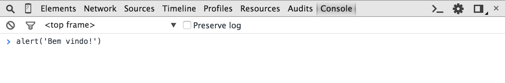

# Um pouquinho da história do JavaScript

No início da _Internet_ as páginas eram pouco ou nada interativas, eram documentos que apresentavam seu conteúdo exatamente como foram criados para serem exibidos no navegador. Existiam algumas tecnologias para a geração de páginas no lado do servidor, mas havia limitações no que diz respeito a como o usuário consumia aquele conteúdo. Navegar através de _links_ e enviar informações através de formulários era basicamente tudo o que se podia fazer.

## História

Visando o potencial da _Internet_ para o público geral e a necessidade de haver uma interação maior do usuário com as páginas, a Netscape, criadora do navegador mais popular do início dos anos 90, de mesmo nome, criou o Livescript, uma linguagem simples que permitia a execução de _scripts_ contidos nas páginas dentro do próprio navegador.

Aproveitando o iminente sucesso do Java, que vinha conquistando cada vez mais espaço no mercado de desenvolvimento de aplicações corporativas, a Netscape logo rebatizou o Livescript como JavaScript num acordo com a Sun para alavancar o uso das duas. A então vice-líder dos navegadores, Microsoft, adicionou ao Internet Explorer o suporte a _scripts_ escritos em VBScript e criou sua própria versão de JavaScript, o JScript.

JavaScript é a linguagem de programação mais popular no desenvolvimento Web. Suportada por todos os navegadores, a linguagem é responsável por praticamente qualquer tipo de dinamismo que queiramos em nossas páginas.

Se usarmos todo o poder que ela tem para oferecer, podemos chegar a resultados impressionantes. Excelentes exemplos disso são aplicações Web complexas como Gmail, Google Maps e Google Docs.

## Características da linguagem

O JavaScript, como o próprio nome sugere, é uma linguagem de _scripting_. Uma linguagem de _scripting_ é comumente definida como uma linguagem de programação que permite ao programador controlar uma ou mais aplicações de terceiros. No caso do JavaScript, podemos controlar alguns comportamentos dos navegadores através de trechos de código que são enviados na página HTML.

Outra característica comum nas linguagens de _scripting_ é que normalmente elas são linguagens **interpretadas**, ou seja, não dependem de compilação para serem executadas. Essa característica é presente no JavaScript: o código é interpretado e executado conforme é lido pelo navegador, linha a linha, assim como o HTML.

O JavaScript também possui **grande tolerância a erros**, uma vez que conversões automáticas são realizadas durante operações. Como será visto no decorrer das explicações, nem sempre essas conversões resultam em algo esperado, o que pode ser fonte de muitos bugs, caso não conheçamos bem esse mecanismo.

O script do programador é enviado com o HTML para o navegador, mas como o navegador saberá diferenciar o script de um código html? Para que essa diferenciação seja possível, é necessário envolver o script dentro da tag `<script>`.

## Console do navegador

Existem várias formas de executar códigos JavaScript em um página. Uma delas é executar códigos no que chamamos de **Console**. A maioria dos navegadores desktop já vem com essa ferramenta instalada. No Chrome, por exemplo, é possível chegar ao Console apertando **F12** e em seguida acessar a aba "Console" ou por meio do atalho de teclado **Control + Shift + i**.

> **Developer Tools**
>
> O console faz parte de uma série de ferramentas embutidas nos navegadores especificamente para nós que estamos desenvolvendo um site. Essa série de ferramentas é o que chamamos de Developer Tools.



## Sintaxe básica

### Operadores

Podemos somar, subtrair, multiplicar e dividir como em qualquer linguagem:

Teste algumas contas digitando diretamente no console:

```js
> 12 + 13
  25
> 14 * 3
  42
> 10 - 4
  6
> 25 / 5
  5
> 23 % 2
  1
```

### Variáveis

Para armazenarmos um valor para uso posterior, podemos criar uma **variável**:

```js
> var resultado = 102 / 17;
undefined
```

No exemplo acima, guardamos o resultado de `102 / 17` na variável `resultado`. O resultado de criar uma variável é sempre **undefined**. Para obter o valor que guardamos nela ou mudar o seu valor, podemos fazer o seguinte:

```js
> resultado
6

> resultado = resultado + 10
16

> resultado
16
```

Também podemos alterar o valor de uma variável usando as operações básicas com uma sintaxe bem compacta:

```js
> var idade = 10; // undefined
> idade += 10; // idade vale 20
> idade -= 5; // idade vale 15
> idade /= 3; // idade vale 5
> idade *= 10; // idade vale 50
```

### Number

Com esse tipo de dados é possível executar todas as operações que vimos anteriormente:

```js
var pi = 3.14159;
var raio = 20;
var perimetro = 2 * pi * raio
```

### String

Não são apenas números que podemos salvar numa variável. O JavaScript tem vários tipos de dados. Uma string em JavaScript é utilizada para armazenar trechos de texto:

```js
var empresa = "Caelum";
```

Para exibirmos o valor da variável empresa fora do console, podemos executar o seguinte comando:

```js
alert(empresa);
```

O comando `alert` serve para criação de __popups__ com algum **conteúdo de texto** que colocarmos dentro dos parênteses. O que acontece com o seguinte código?

```js
var numero = 30;
alert(numero)
```

O número 30 é exibido sem problemas dentro do __popup__. O que acontece é que qualquer variável pode ser usada no `alert`. O JavaScript não irá diferenciar o tipo de dados que está armazenado numa variável, e se necessário, tentará converter o dado para o tipo desejado.

### Automatic semicolon insertion (ASI)

É possível omitir o ponto e vírgula no final de cada declaração. A omissão de ponto e vírgula funciona no JavaScript devido ao mecanismo chamado _automatic semicolon insertion_ (ASI).

## A tag script

O console nos permite testar códigos diretamente no navegador. Porém, não podemos pedir aos usuários do site que sempre abram o console, copiem um código e colem para ele ser executado.

Para inserirmos um código JavaScript em uma página, é necessário utilizar a tag `<script>`:

```html
<script>
  alert("Olá, Mundo!");
</script>
```

A tag `<script>` pode ser declarada dentro da tag `<head>` assim como na tag `<body>`, mas devemos ficar atentos, porque o código é lido imediatamente dentro do navegador. Veja a consequência disso nos dois exemplos abaixo:

```html
<!DOCTYPE html>
<html>
  <head>
    <meta charset="utf-8">
    <title>Aula de JS</title>
    <script>
       alert("Olá, Mundo!");
    </script>
  </head>
  <body>
    <h1>JavaScript</h1>
    <h2>Linguagem de programação</h2>
  </body>
</html>
```

Repare que, ao ser executado, o script trava o processamento da página. Imagine um script que demore um pouco mais para ser executado ou que exija alguma interação do usuário como uma confirmação. Não seria interessante carregar a página toda primeiro antes de sua execução por uma questão de performance e experiência para o usuário?

Para fazer isso, basta removermos o script do `<head>`, colocando-o no final do `<body>`:

```html
<!DOCTYPE html>
<html>
  <head>
    <meta charset="utf-8">
    <title>Aula de JS</title>
  </head>
  <body>
    <h1>JavaScript</h1>
    <h2>Linguagem de Programação</h2>
    <script>
      alert("Olá, Mundo!");
    </script>
  </body>
</html>
```

Devemos sempre colocar o script antes de fecharmos a tag `</body>`? Na maioria esmagadora das vezes sim.

## JavaScript em arquivo externo

Se o mesmo script for utilizado em outra página, como fazemos? Imagine ter que reescrever o script toda vez que ele for necessário. Para não acontecer isso, é possível importar scripts dentro da página utilizando também a tag `<script>`:

```html
<script type="text/javascript" src="js/hello.js"></script>
```

```js
alert("Olá, Mundo!");
```

Com a separação do script em arquivo externo é possível reaproveitar alguma funcionalidade em mais de uma página.

## Mensagens no console

É comum querermos dar uma olhada no valor de alguma varíavel ou resultado de alguma operação durante a execução do código. Nesses casos, poderíamos usar um _alert_. Porém, se esse conteúdo deveria somente ser mostrado para o desenvolvedor, o console do navegador pode ser utilizado no lugar do alert para imprimir essa mensagem:

```js
var mensagem = "Olá mundo";
console.log(mensagem);
```

> **Impressão de variáveis diretamente do console**
>
> Quando você estiver com o console aberto, não é necessário chamar `console.log(nomeDaVariavel)`: você pode chamar o nome da variável diretamente que ela será impressa no console.

## DOM: sua página no mundo JavaScript

Para permitir alterações na página, ao carregar o HTML da página, os navegadores carregam em memória uma estrutura de dados que representa cada uma das nossas tags no JavaScript. Essa estrutura é chamada de DOM (**D**ocument **O**bject **M**odel). Essa estrutura pode ser acessada através da variável global `document`.

O termo "documento" é frequentemente utilizado em referências à nossa página. No mundo front-end, documento e página são sinônimos.

<!--@note
Você pode pedir para os alunos imprimirem `document` no console. Ele lembrará a
estrutura da página que estamos exibindo.
-->

## querySelector

Antes de sair alterando nossa página, precisamos em primeiro lugar acessar no JavaScript o elemento que queremos alterar. Como exemplo, vamos alterar o conteúdo de um título da página. Para acessar ele:

```js
document.querySelector("h1")
```

Esse comando usa os **seletores CSS** para encontrar os elementos na página. Usamos um seletor de nome de tag mas poderíamos ter usado outros:

```js
document.querySelector(".class")
document.querySelector("#id")
```

## Elemento da página como variável

Se você vai utilizar várias vezes um mesmo elemento da página, é possível salvar o resultado de qualquer `querySelector` numa variável:

```js
var titulo = document.querySelector("h1")
```

Executando no console, você vai perceber que o elemento correspondente é selecionado. Podemos então manipular seu conteúdo. Você pode ver o conteúdo textual dele com:

```js
titulo.textContent
```

Essa propriedade, inclusive, pode receber valores e ser alterada:

```js
titulo.textContent = "Novo título"
```

## querySelectorAll

As vezes você precisa selecionar vários elementos na página. Várias tags com a classe `.cartao` por exemplo. Se o retorno esperado é mais de um elemento, usamos `querySelectorAll` que devolve uma lista de elementos (_array_).

```js
document.querySelectorAll(".cartao")
```

Podemos então acessar elementos nessa lista através da posição dele (começando em zero) e usando o colchetes:

```js
// primeiro cartão
document.querySelectorAll(".cartao")[0]
```

## Alterações no DOM

Ao alterarmos os elementos da página, o navegador sincroniza as mudanças e alteram a aplicação em tempo real.

## Funções e os eventos do DOM

Apesar de ser interessante a possibilidade de alterar o documento todo por meio do JavaScript, é muito comum que as alterações sejam feitas quando o usuário executa alguma ação, como por exemplo, mudar o conteúdo de um botão ao clicar nele e não quando a página carrega. Porém, por padrão, qualquer código colocado no `<script>`, como fizemos anteriormente, é executado assim que o navegador lê ele.

Para guardarmos um código para ser executado em algum outro momento, por exemplo, quando o usuário clicar num botão, é necessário utilizar alguns recursos do JavaScript no navegador. Primeiro vamos criar uma **função**:

```js
function mostraAlerta() {
  alert("Funciona!");
}
```

Ao criarmos uma função, simplesmente guardamos o que estiver dentro da função, e esse código guardado só será executado quando **chamarmos** a função, como no seguinte exemplo:

```js
function mostraAlerta() {
  alert("Funciona!");
}

// fazendo uma chamada para a função mostraAlerta, que será executada nesse momento
mostraAlerta()
```

Para chamar a função **mostraAlerta** só precisamos utilizar o nome da função e logo depois abrir e fechar parênteses.

Agora, para que essa nossa função seja chamada quando o usuário clicar no botão da nossa página, precisamos do seguinte código:

```js
function mostraAlerta() {
  alert("Funciona!");
}

// obtendo um elemento através de um seletor de ID
var botao = document.querySelector("#botaoEnviar");

botao.onclick = mostraAlerta;
```

Note que primeiramente foi necessário selecionar o botão e depois definir no `onclick` que o que vai ser executado é a função `mostraAlerta`. Essa receita será sempre a mesma para qualquer código que tenha que ser executado após alguma ação do usuário em algum elemento. O que mudará sempre é qual elemento você está selecionando, a qual evento você está reagindo e qual função será executada.

### Quais eventos existem

Existem diversos eventos que podem ser utilizados em diversos elementos para que a interação do usuário dispare alguma função:

* oninput: quando um elemento input tem seu valor modificado
* onclick: quando ocorre um click com o mouse
* ondblclick: quando ocorre dois clicks com o mouse
* onmousemove: quando mexe o mouse
* onmousedown: quando aperta o botão do mouse
* onmouseup: quando solta o botão do mouse (útil com os dois acima para gerenciar drag'n'drop)
* onkeypress: quando pressionar e soltar uma tecla
* onkeydown: quando pressionar uma tecla
* onkeyup: quando soltar uma tecla
* onblur: quando um elemento perde foco
* onfocus: quando um elemento ganha foco
* onchange: quando um input, select ou textarea tem seu valor alterado
* onload: quando a página é carregada
* onunload: quando a página é fechada
* onsubmit: disparado antes de submeter o formulário (útil para realizar validações)

Existem também uma série de outros eventos mais avançados que permitem a criação de interações para drag-and-drop, e até mesmo a criação de eventos customizados.

## Funções Anônimas

No exercício anterior nós indicamos que a função mostraTamanho deveria ser executada no momento em que o usuário inserir o tamanho do produto no `<input type="range">`. Note que não estamos executando a função mostraTamanho, já que não colocamos os parênteses. Estamos apenas indicando o nome da função que deve ser executada.

```js
inputTamanho.oninput = mostraTamanho

function mostraTamanho(){
    outputTamanho.value = inputTamanho.value
}
```

Há algum outro lugar do código no qual precisamos chamar essa função? Não! Porém, é pra isso que damos um nome à uma função, para que seja possível usá-la em mais de um ponto do código.

É muito comum que algumas funções tenham uma única referência no código. É o nosso caso com a função `mostraTamanho`. Nesses casos, o JavaScript permite que criemos a função no lugar onde antes estávamos indicando seu nome.

```js
inputTamanho.oninput = function() {
    outputTamanho.value = inputTamanho.value
}
```

Transformamos a função mostraTamanho em uma função sem nome, uma função anônima. Ela continua sendo executada normalmente quando o usuário alterar o valor para o tamanho.

## Manipulando strings

Uma variável que armazena um string faz muito mais que isso! Ela permite, por exemplo, consultar o seu tamanho e realizar transformações em seu valor.

```js
var empresa = "Caelum";

empresa.length; // tamanho da string

empresa.replace("lum","tano"); // retorna Caetano
```

A partir da variável `empresa`, usamos o operador `ponto` seguido da ação `replace`.

<!--@note
Evite o termo objeto aqui. Quando chegar em objeto, revele que não apenas String, mas Number e Boolean são objetos.
-->

## Imutabilidade

**String é imutável**. Logo, no exemplo abaixo, se a variável `empresa` for impressa após a chamada da função `replace`, o valor continuará sendo "Caelum". Para obter uma string modificada, é necessário receber o retorno de cada função que manipula a string, pois uma nova string modificada é retornada:

```js
var empresa = "Caelum";

// substitui a parte "lum" por "tano"
empresa.replace("lum","tano");
console.log(empresa); // imprime Caelum, não mudou!

empresa = empresa.replace("lum","tano");
console.log(empresa); // imprime Caetano, mudou!
```

## Conversões

O JavaScript possui funções de conversão de string para number:

```js
var textoInteiro = "10";
var inteiro = parseInt(textoInteiro);

var textoFloat = "10.22";
var float = parseFloat(textoFloat);
```

## Manipulando números

Number, assim como string, também é imutável. O exemplo abaixo altera o número de casas decimais com a função `toFixed`. Esta função retorna uma string, mas, para ela funcionar corretamente, seu retorno precisa ser capturado:

```js
var milNumber = 1000;
var milString = milNumber.toFixed(2); // recebe o retorno da função
console.log(milString); // imprime a string "1000.00"
```

<!--@note
toFixed converte para String com casas decimais quando passamos um inteiro como argumento! var novoNumero = new Number(seuNumero.toFixed(2)).valueOf();
-->

## Concatenações

É possível concatenar (juntar) tipos diferentes e o JavaScript se encarregará de realizar a conversão entre os tipos, podendo resultar em algo não esperado.

### String com String

```js
var s1 = "Caelum";
var s2 = "Inovação";
console.log(s1 + s2); // imprime CaelumInovação
```

### String com outro tipo de dados

Como vimos, o JavaScript tentará ajudar realizando conversões quando tipos diferentes forem envolvidos numa operação, mas é necessário estarmos atentos na maneira como ele as realiza:

```js
var num1 = 2;
var num2 = 3;
var nome = "Caelum"

// O que ele imprimirá?

// Exemplo 1:
console.log(num1 + nome + num2); // imprime 2Caelum3

// Exemplo 2:
console.log(num1 + num2 + nome); // imprime 5Caelum

// Exemplo 3:
console.log(nome + num1 + num2); // imprime Caelum23

// Exemplo 4:
console.log(nome + (num1 + num2)); // imprime Caelum5

// Exemplo 5:
console.log(nome + num1 * num2); // imprime Caelum6
// A multiplicação tem precedência
```

> **NaN**
>
> Veja o código abaixo:
>
> ```js
>   console.log(10-"curso")
> ```
>
> O resultado é `NaN` (not a number). Isto significa que todas operações matemáticas, exceto subtração, que serão vistas mais a frente, só podem ser feitas com números. O valor `NaN` ainda possui uma peculiaridade, definida em sua especificação:
>
> ```js
> var resultado = 10-"curso"; // retorna NaN
> resultado == NaN; // false
> NaN == NaN; // false
> ```
>
> Não é possível comparar uma variável com `NaN`, nem mesmo `NaN` com `NaN`! Para saber se uma variável é `NaN`, deve ser usada a função **isNaN**:
>
> ```js
> var resultado = 10-"curso";
> isNaN(resultado); // true
> ```
